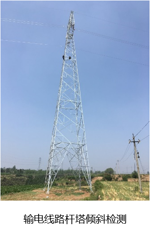
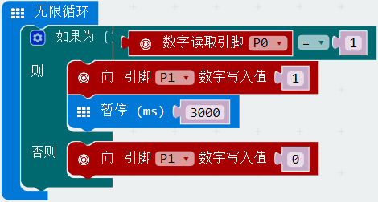
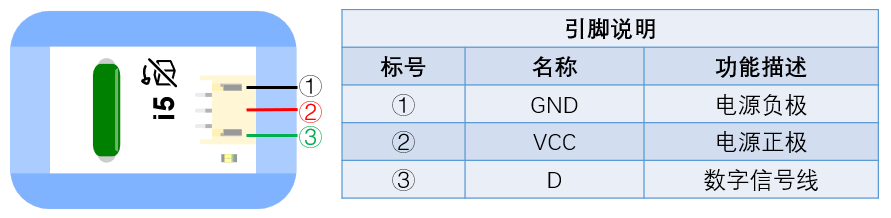

# i5傾斜感測器

## 實體照片

## 基本信息

中文名稱：傾斜感測器

英文名稱：Tilt Switch

序號：i5

SKU：BOS0005

## 功能簡介

傾斜感測器是一款可以檢測物體是否發生傾斜的數位輸入模組，在實際應用中具有重要價值，可以用來評估橋樑、房屋、高壓電塔等物體的傾斜情況，對開拓、維護等工作具有重要的測量作用。

## 使用說明

傾斜感測器可以與Arduino專用感測器擴充板結合使用，實現非常有趣的互動作品，比使用水銀開關更加安全。通過控制傾斜感測器的傾斜度可以切換開關的閉合或斷開。

> * 當傾斜感測器水平放置時，輸出低電位；當傾斜感測器發生傾斜時，輸出高電位。

按照下圖所示連接電路，通電後即可使用傾斜感測器控制LED燈的亮滅：當傾斜感測器發生傾斜時，LED燈被點亮；否則LED燈被熄滅。

## 原理介紹

傾斜感測器是基於鋼珠開關的數位模組，利用鋼珠的特性，當傾斜感測器受到外力作用偏離水平位置時，內部鋼珠受到重力作用向低處滾落，從而使開關閉合或斷開，因此也可以作為簡單的傾角感測器使用。

## 應用範例

### \(1\) 製作存錢罐

**範例說明：**每次投幣時，硬幣會使得傾斜感測器傾斜，傾斜感測器每傾斜一次，計數模組計數加1。

**元件清單：**傾斜感測器；按鈕模組；主控板：1組輸入/輸出端；計數模組。

**連線圖：**

### \(2\) 畫廊展示品防盜警報器

**範例說明：**當有人觸摸展品或者展品發生傾斜時，自動發出警報。

**元件清單：**傾斜感測器；觸碰感測器；運算邏輯模組 OR；主控板：1組輸入/輸出端；計時模組（0-6秒）；蜂鳴器模組。

**連線圖：**

### \(3\) 傾斜警報器

**範例說明：**若傾斜感測器檢測到發生傾斜，蜂鳴器模組開始鳴叫並持續3秒鐘。

**元件清單：**傾斜感測器；蜂鳴器模組；Micro:bit；Micro:bit BOSON擴充板。

**連線圖：**

**設計意圖：**傾斜感測器在發生傾斜時會輸出高電位，否則輸出低電位。製作傾斜警報器時需要先讀取傾斜感測器輸出的數位信號，若讀取到高電位，表示已經發生傾斜，為蜂鳴器模組寫入高電位，蜂鳴器開始鳴叫；否則為蜂鳴器模組寫入低電位，蜂鳴器停止鳴叫。

**執行流程：**① 已發生傾斜：當傾斜感測器輸出數位訊號“1”，為蜂鳴器模組寫入高電位，蜂鳴器開始鳴叫，暫停3秒；② 未發生傾斜：為蜂鳴器模組寫入低電位，蜂鳴器停止鳴叫。

**程式示意圖（中文版）：**

** Example program(English)：**

## 商品規格

腳位說明：

 

| **編號** | **名稱** | **功能說明** |
| :--- | :--- | :--- |
| 1 | GND | 電源接地 |
| 2 | VCC | 電源正極 |
| 3 | D | 數位訊號 |

重量： （g）

尺寸：26mm\*22mm

工作電壓：3.0-5.0V

