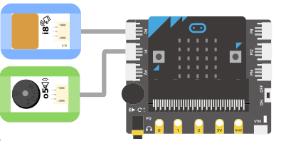
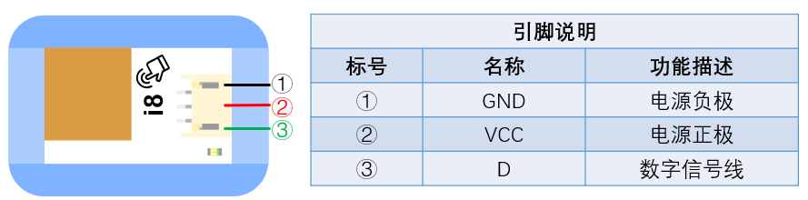

# i8觸碰感測器

## 實體照片

## 基本信息

中文名稱：觸碰感測器

英文名稱：Touch Sensor

序號：i8

SKU：BOS0008

## 功能簡介

觸碰感測器是一款可以感受到物體是否與感測器有接觸的數位輸入模組，該感測器可以讓你擺脫常規按壓型按鍵的煩惱，廣泛應用於數相機、遊戲機、安全防護設備、汽車儀錶盤、家用電器、密碼箱櫃和觸碰感應式門禁等場景中。

## 使用說明

觸碰感測器與Arduino感測器擴充板結合使用，可以製作出非常有趣的觸碰互動作品。

> * 常態下，觸碰感測器輸出低電位；當用手指觸碰到觸碰感測器上的金屬面時，觸碰感測器輸出高電位。

按照下圖所示連接電路，通電後即可通過觸碰感測器控制LED燈：當感應到觸碰後點亮LED燈，否則熄滅LED燈。

除了直接觸碰金屬面外，隔著一定厚度的塑膠、玻璃等材料也可以被感應到，但感應靈敏度與金屬面的大小和覆蓋材料的厚度有關係。 此外，可以將觸碰感測器安裝在非金屬材料如塑膠、玻璃的表面，然後將薄薄的紙片覆蓋在模組的表面，只要觸碰位置正確，即可做成隱藏在牆壁、桌面等地方的按鍵。

**\*注意：**使用時請注意模組需要離桌面一定高度（與桌面材料有關）。\*

## 原理介紹

觸碰感測器是一款基於電容式感應的觸碰開關模組，在電氣工程學中，電容式感應是基於電容耦合原理的一種技術，可用在多種感應器上。電容式感應器可以偵測到任何導電或具備介電性能的物體。它可以取代傳統的機械按鍵，其它的一些新技術，如多點觸控和基於手勢的觸控螢幕也是以電容式感應為前提的。來源：[電容式感應-維基](https://zh.wikipedia.org/wiki/%E7%94%B5%E5%AE%B9%E5%BC%8F%E6%84%9F%E5%BA%94)

## 應用範例

### \(1\) 暴躁的小豬

**範例說明：**製作一個小豬，將觸碰感測器放在小豬的耳朵上，當觸碰小豬的耳朵時，小豬發出叫聲。

**元件清單：**觸碰感測器；主控板：1組輸入/輸出端；蜂鳴器模組。

**連線圖：**

### \(2\) 觸碰檯燈

**範例說明：**當用手摸開關時，小燈自動亮起。

**元件清單：**觸碰感測器；主控板：1組輸入/輸出端；計時模組（0-6秒）；LED燈模組。

**連線圖：**

### \(3\) 畫廊展示品防盜報警器

**範例說明：**當有人觸碰展品或者展品發生傾斜時，自動報警。

**元件清單：**觸碰感測器；傾斜感測器；運算邏輯模組 OR；主控板：1組輸入/輸出端；計時模組（0-6秒）；蜂鳴器模組。

**連線圖：**

### \(4\) 害羞的Micro:bit

**範例說明：**Micro:bit非常害羞，只有沒人摸到觸碰感測器的時候他才會露出笑臉，當有人摸到觸碰感測器後，他的LED燈點陣會顯示哭臉，還會發出“哭聲”。

**元件清單：**觸碰感測器；蜂鳴器模組；Micro:bit；Micro:bit BOSON擴充板。

**連線圖：**

**設計意圖：**通過讀取觸碰感測器輸出的數位訊號判斷是否發生觸碰，若發生觸碰，Micro:bit的LED燈點陣顯示哭臉並讓蜂鳴器鳴叫2秒鐘，否則Micro:bit的LED燈點陣上顯示笑臉。

**執行流程：**

① Micro:bit感知到觸碰：Micro:bit的LED燈點陣顯示哭臉、蜂鳴器發出警報並持續2秒；

② Micro:bit未感知觸碰：Micro:bit的LED燈點陣顯示笑臉持續2秒，蜂鳴器停止鳴叫。

**程式示意圖（中文版）：**

**Example program(English)：**

## 商品規格

腳位說明：

| **編號** | **名稱** | **功能說明** |
| :--- | :--- | :--- |
| 1 | GND | 電源接地 |
| 2 | VCC | 電源正極 |
| 3 | D | 數位訊號 |

重量： （g）

尺寸：26mm\*22mm

工作電壓：3.0-5.0V

