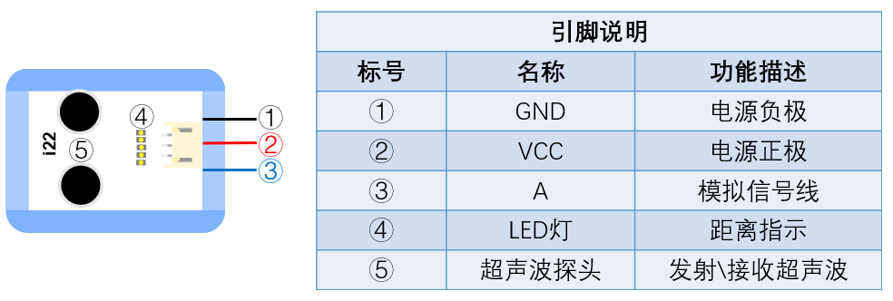

# i22超音波感測器

## 實體照片

## 基本信息

中文名稱：超音波感測器

英文名稱：Ultrasonic Sensor

序號：i22

SKU：BOS0045

## 功能簡介

人耳朵能聽到的音波頻率為20Hz～20000Hz，當音波的振動頻率大於20000Hz或小於20Hz時，人耳無法聽到。我們把頻率高於20000赫茲的音波稱為超音波。超音波在測距、測速、測障、清洗牙齒、醫療透視儀、殺菌消毒、焊接鋁金屬等設備中均有廣泛應用。

## 使用說明

將超音波感測器正對待測物體，當超音波感測器測得物體距離時，感測器會亮起相應數目的LED燈並將實際測得的距離輸出。超音波感測器的測量距離為0cm~100cm，測量距離和亮燈數量之間的關係如下圖所示：

按照下圖所示連接電路，通電後再將超音波感測器正對待測物體即可通過OLED顯示模組查看待測物體與超音波感測器之間的距離。

## 原理介紹

超音波感測器利用超音波在空氣中的傳播速度為已知，測量音波在發射後遇到障礙物反射回來的時間，根據發射和接收的時間差計算出發射點到障礙物的實際距離。在測量過程中，該感測器會向某一方向發射超音波，在發射的同時開始計時，超音波在空氣中傳播，途中碰到障礙物就立即返回來，超音波接收器收到反射波就立即停止計時。超音波在15℃空氣中的傳播速度為340m/s，根據計時器記錄的時間，就可以計算出發射點距障礙物的距離。感測器上的LED燈可以直觀的展示距離的遠近。

## 應用範例

### \(1\) 倒車雷達

**範例說明：**倒車時，當超音波感測器檢測到後方有障礙物時，揚聲器播報聲音“請注意後方障礙物”，提醒司機後方有障礙物，保證倒車安全。

**元件清單：**超音波感測器；主控板：3組輸入/輸出端；錄音機模組/喇叭。

**連線圖：**

### \(2\) 守衛安全

**範例說明：**設置我們想要的安全距離，當然這個距離要在1米以內。當有危險物體進入我們的安全距離，被超音波感測器檢測到了，LED燈就會亮起通知我們，提醒我們注意安全。

**元件清單：**超音波感測器；主控板：3組輸入/輸出端；閥模組；LED燈模組。

**連線圖：**

### \(3\) 帶距離感應的智慧風扇

**範例說明：**讓風扇模組根據人離風扇的距離遠近來調節轉速：當人距離風扇20cm內，風扇開啟1檔；當人距離風扇20~40cm，風扇開啟2檔；當人距離風扇40~60cm，風扇開啟3檔；當人的距離在60cm以外，風扇停止轉動（注意：風扇的三個檔位對應轉速為1檔轉速最快，3檔轉速最慢，2檔轉速居中）。

**元件清單：**超音波感測器；風扇模組；Micro:bit；Micro:bit BOSON擴充板。

**連線圖：**

**設計意圖：**使用超音波感測器感知人離風扇的距離（假設風扇周圍沒有其他障礙物），根據超音波感測器感知的距離值調節風扇的轉速。

**執行流程：**

① 讀取人與風扇的距離：接收超音波感測器測得的距離值；

② 若距離值小於20cm，把風扇轉速調為1檔（最快）；

③ 若距離值在20~40cm之間，把風扇轉速調為2檔（適中）；

④ 若距離值在40~60cm之間，把風扇轉速調為3檔（最慢）；

⑤ 若距離值大於60cm，關閉風扇。

**程式示意圖（中文版）：**

**Example program(English)：**

## 商品規格

腳位說明：

| **編號** | **名稱** | **功能說明** |
| :--- | :--- | :--- |
| 1 | GND | 電源接地 |
| 2 | VCC | 電源正極 |
| 3 | A | 類比訊號 |
| 4 | LED燈 | 距離指示 |
| 5 | 超音波探頭 | 發射、接收超音波 |

重量：\(g\)

尺寸：38mm\*32mm

工作電壓：3V-5V

