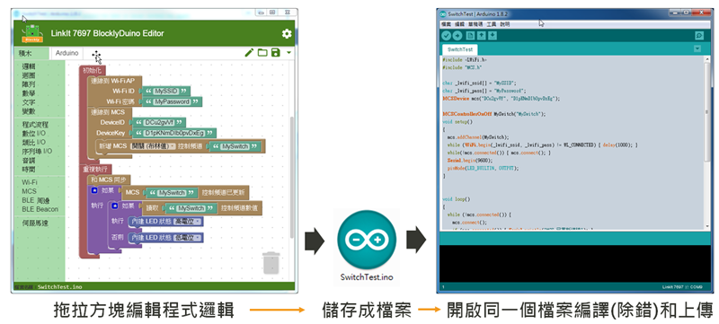

# 安裝開發環境 (v2)

要順利開發會需要以下步驟安裝並設定 **Arduino** 和 **BlocklyDuino**，步驟如下:

* ****[**安裝 Arduino 編輯器**](an-zhuang-arduino-bian-ji-qi.md)****
* ****[**安裝 USB-UART 驅動, 連接 PC 和 LinkIt 7697 開發板**](an-zhuang-qu-dong-bing-lian-jie-kai-fa-ban.md)****
* ****[**安裝 BlocklyDuino 編輯器**](an-zhuang-blocklyduino-bian-ji-qi.md)****
* ****[**連結 BlocklyDuino 和 Arduino，編譯並上傳程式到開發 **](lian-jie-liang-ge-bian-ji-qi-bing-shang-chuan-cheng-shi.md)****

若以上設定正確, 在 BlocklyDuino 修改程式結束並完成存檔後, 程式碼會自動跟新到 Arduino 編輯器, 在 Arduino 編輯器內編譯和上傳

