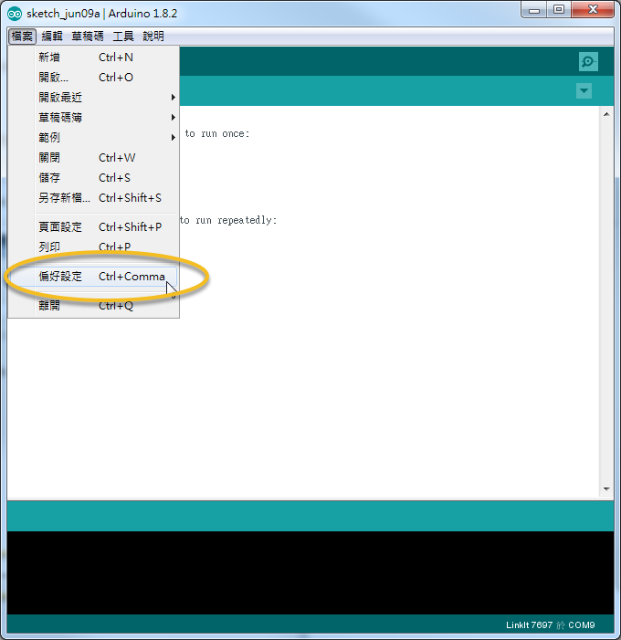
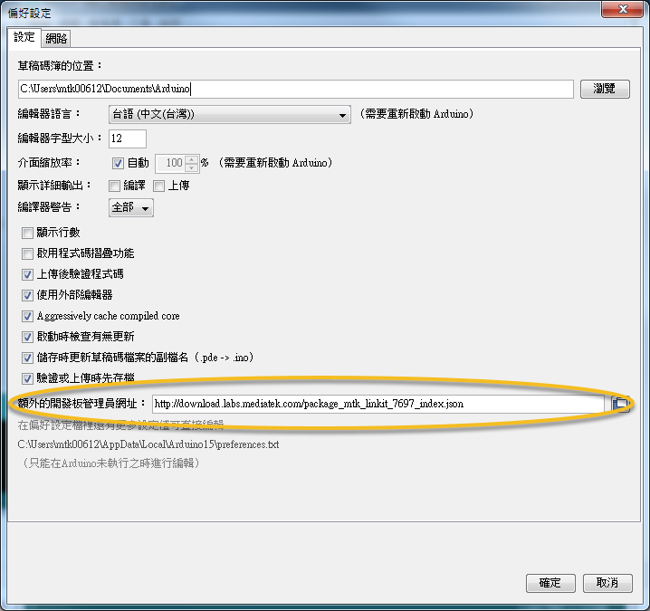
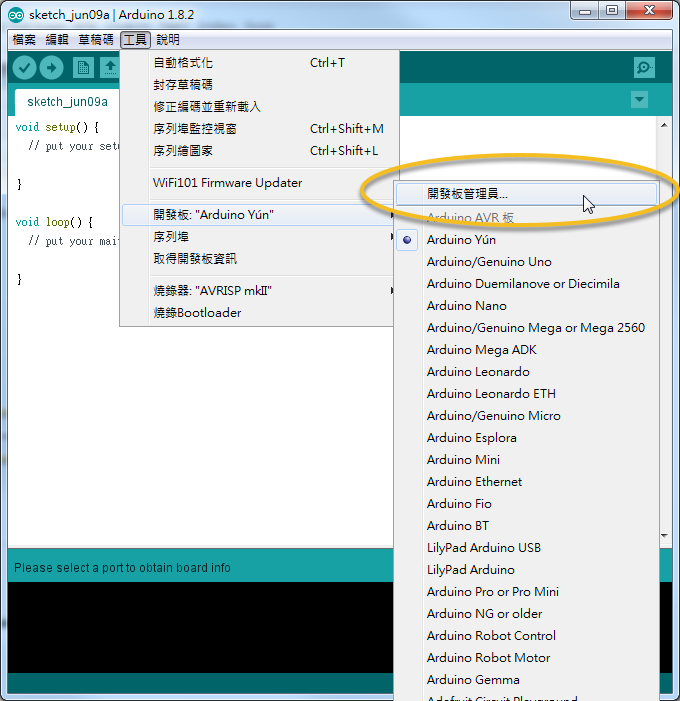
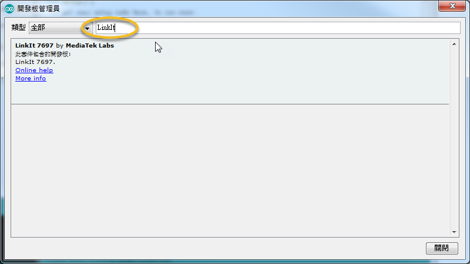
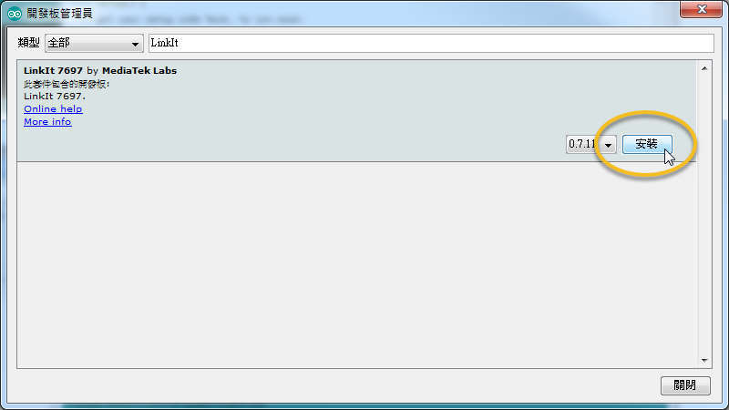
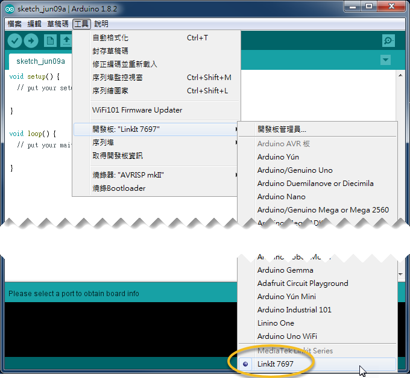

# 安裝 Arduino 編輯器

1\. 下載並安裝 [Arduino ](https://www.arduino.cc/en/Main/OldSoftwareReleases#previous)編輯器 (此範例是基於 1.8.2)

2\. 開啟 **檔案 > 偏好設定**



3.將下面這 URL 貼入 "額外的開發板管理員網址"， 變點選 "確定" 關閉視窗

```
http://download.labs.mediatek.com/package_mtk_linkit_7697_index.json
```



4\. 選取 **工具 > 開發板 > 開發板管理員**



**5.**於輸入框輸入 "LinkIt"， 開發板管理員會找到 LinkIt 7697 的套件包



6\. 點選 "安裝"， 編輯器會開始下載 LinkIt 7697 套件包， 下載完請關閉視窗



7\. LinkIt 7697 套件包安裝完成後， 就可於 **工具 > 開發板** 取選擇使用 **LinkIt 7697**


