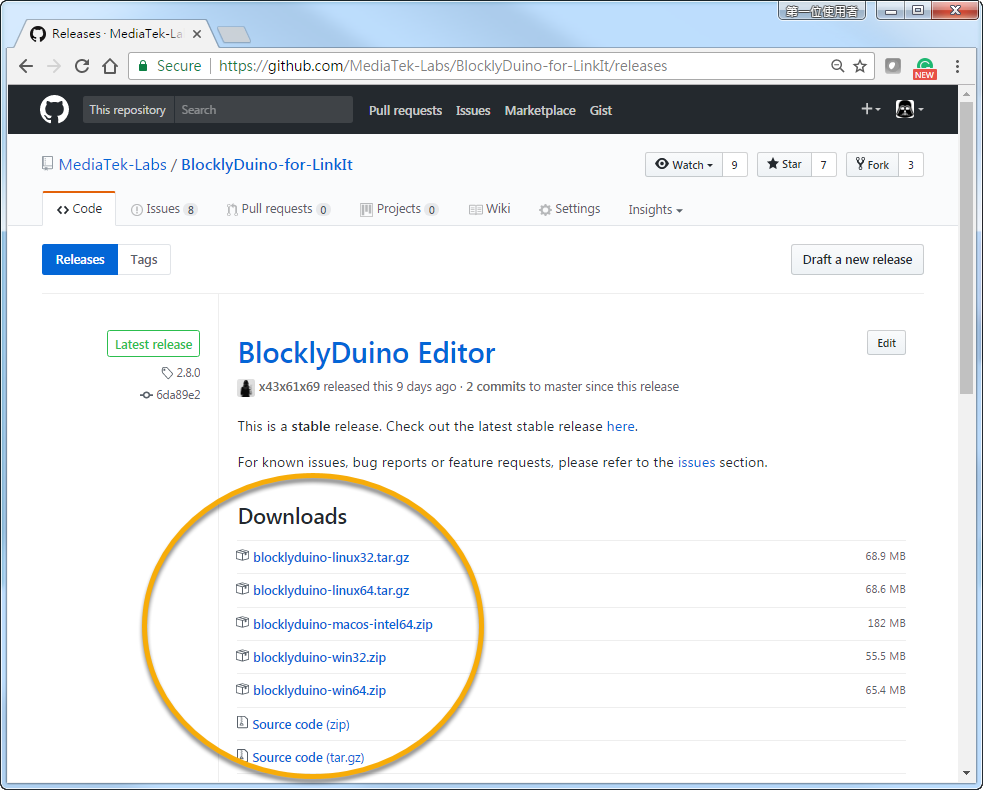
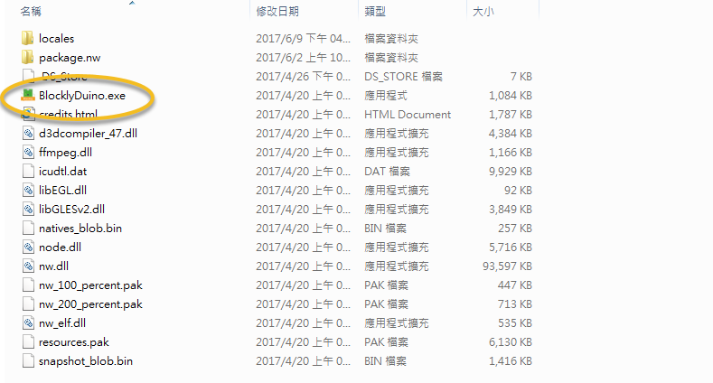
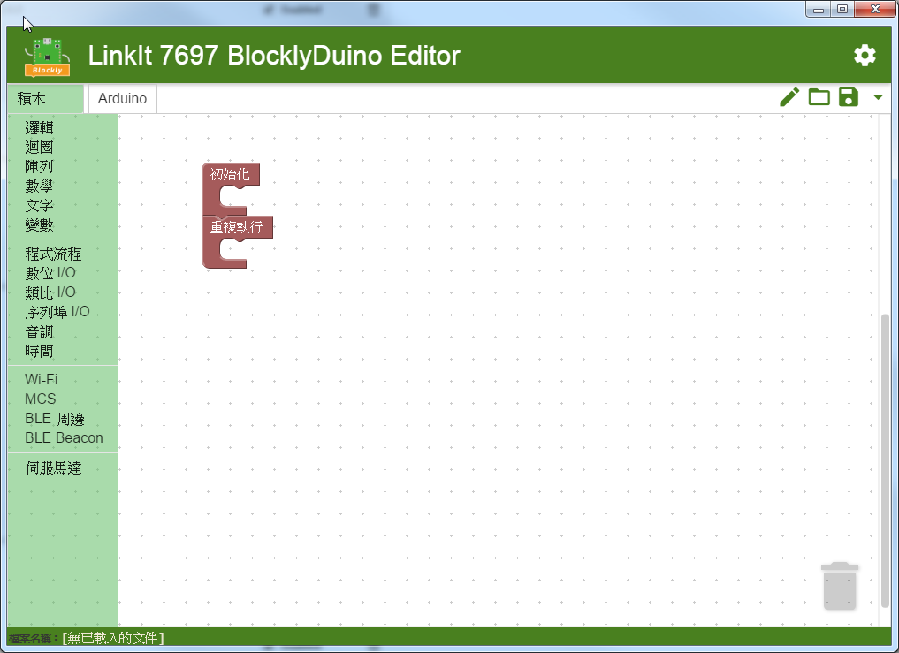

# 安裝 BlocklyDuino 編輯器

1\. 於[下載頁面](https://github.com/MediaTek-Labs/BlocklyDuino-for-LinkIt/releases)選擇適合 **BlocklyDuino 編輯器**，目前提供 **Windows**, **macOS**, **Linux** 三種版本。

2\. 請依照自己的喜好位置解開壓縮包 (綠色軟體， 無須安裝過程)， 並執行 **BlocklyDuino.exe**

3\. 看到畫布就可以開始使用囉。可以參考 [BlocklyDuino 基礎操作](https://docs.labs.mediatek.com/linkit-7697-blocklyduino/blocklyduino-12879598.html) 了解如何使用

