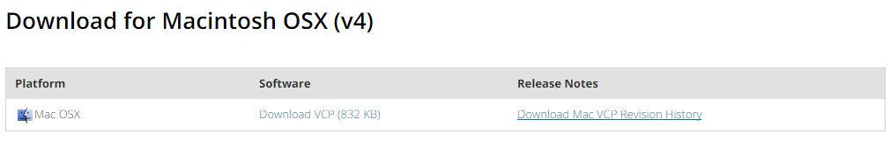
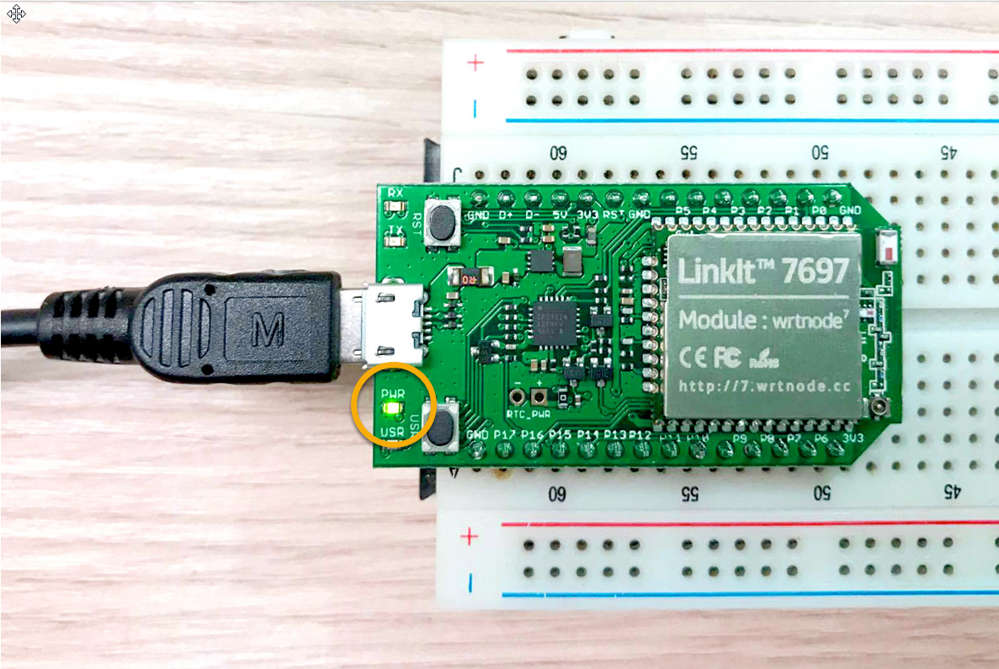
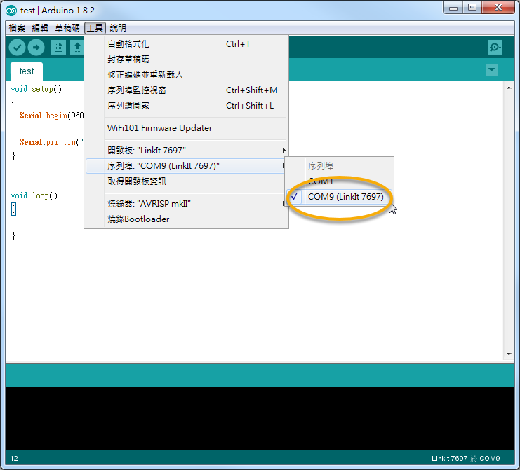
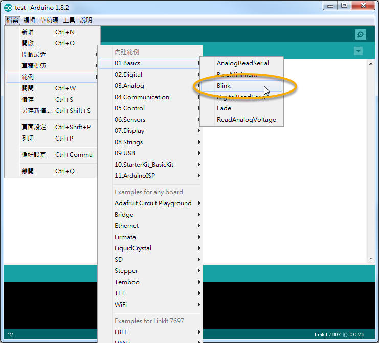
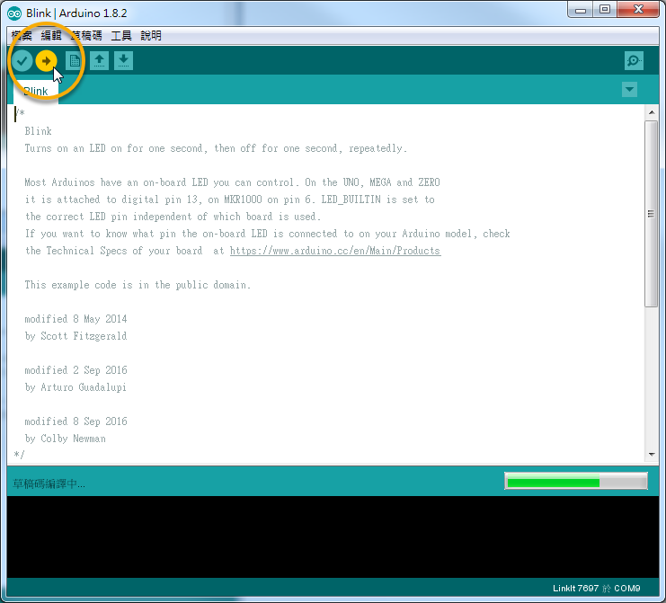
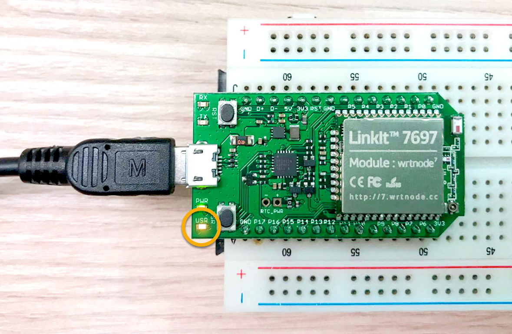

# 安裝驅動並連接開發板

1. 下載並安裝 CP2102N 驅動程式。 CP2102N 是開發板上的 USB 轉 UART 晶片， 透過此晶片來連接 PC

[下載CP2102N 驅動程式](https://www.silabs.com/developers/usb-to-uart-bridge-vcp-drivers)


請選擇符合您使用平台的驅動程式來安裝:



2.透過 micro-USB 連接開發板， 可看到板上的 PWR LED 點亮，表示開發板有被正確供電

3\. 在 Arduino IDE， 從 **工具 > 序列埠，**  選擇 **LinkIt 7697** 使用的 COM port

4\. 載入 **範例 > 01.Basic > Blink**&#x20;

5\. 按下 **上傳**  按鈕， IDE 會**編譯**和**上傳**

6\. 若一切順利就可以看到 **USR LED** 在閃爍。 到這一步， Arduino IDE 以及 LinkIt 7697 開發板都正確連接了

