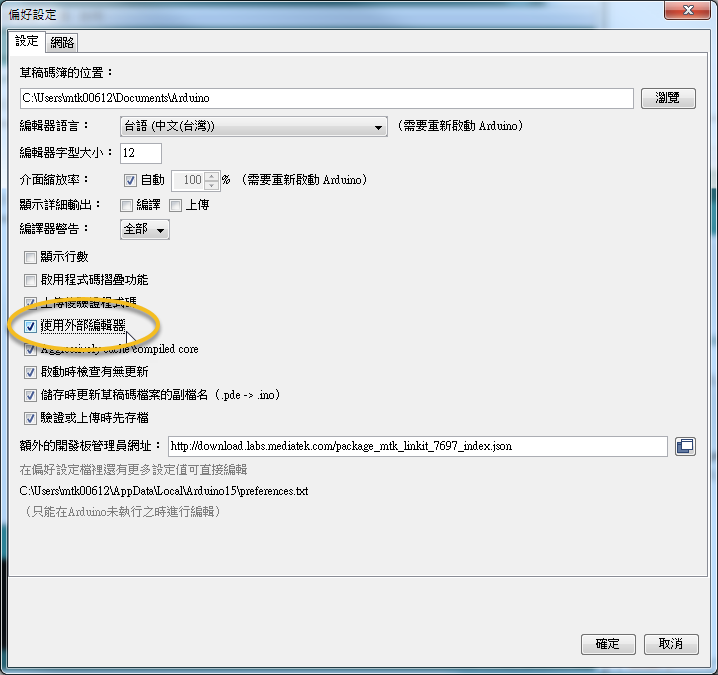
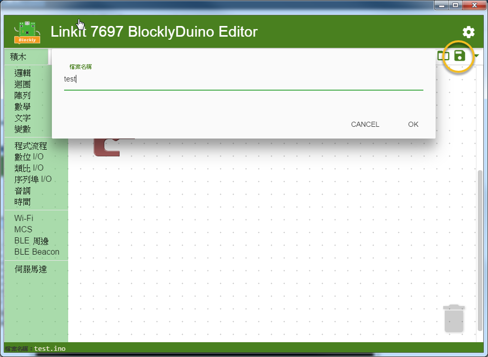
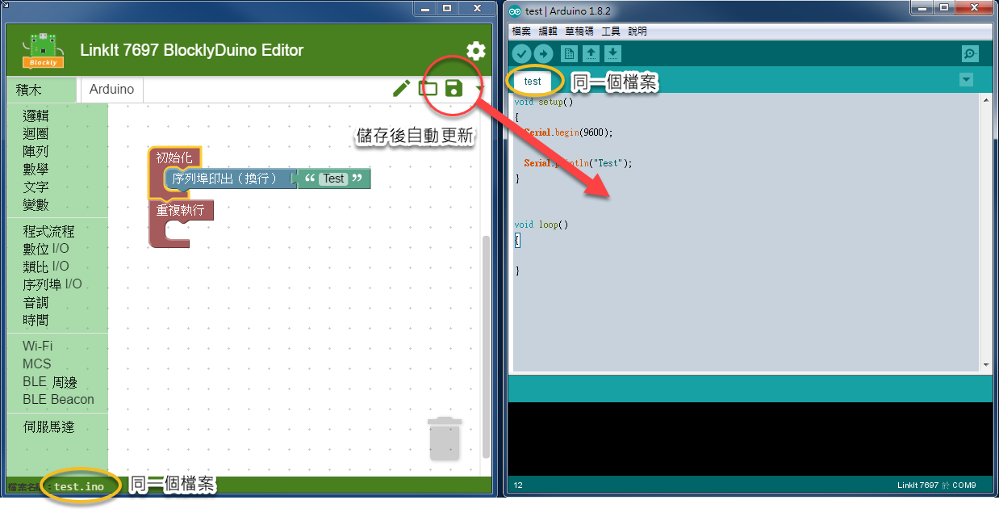
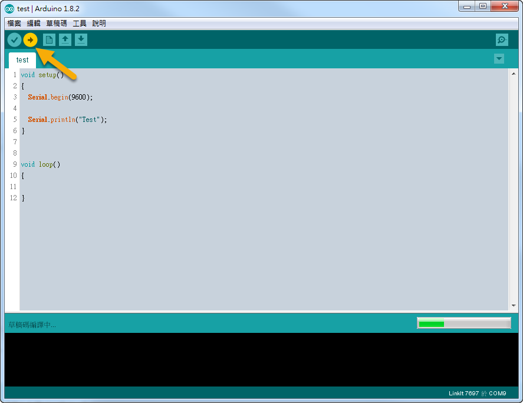
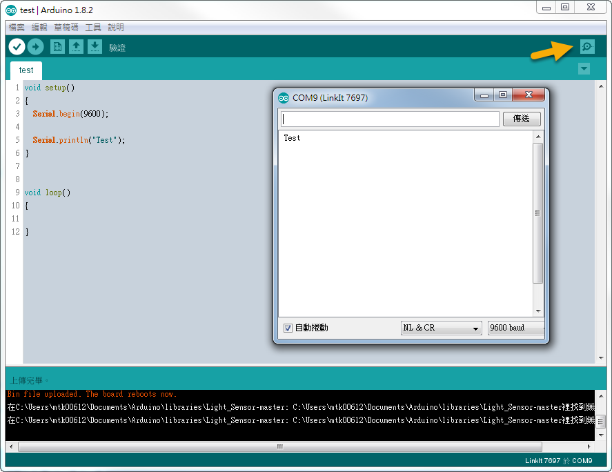

# 連結兩個編輯器並上傳程式

1\. 打開 Arduino IDE，  選擇 **檔案 > 偏好設定**，  將 **"使用外部編輯器"** 勾選起來， 此後 Arduino 編輯器內就無法更改程式

2\. 在 **BlocklyDuino** 內把目前編輯的畫布儲存起來

**3. Arduino IDE** 內去開啟剛儲存的檔案 (.ino)

.png>)

4\. 此時兩個編輯器已透建立連動， 只要 **BlocklyDuino** 內更動過並按一下**儲存**。 Arduino IDE 內的程式就會自動更新

5\. 在 Arduino 編輯器內，點選左上方的**箭頭，**Arduino **** 編輯器會**編譯程式**和**上傳到開發板** (上傳過程中，開發板 TX/RX 會持續閃爍)

6\. 後續範例中，常會印一些資訊來除錯，可以打開**序列埠監控視窗**來看到開發板輸出的資訊

## FAQ 

**Q: 我怎樣知道 Arduino 編輯器有沒有在正確上傳?**

A: 上傳到開發板， 你應該會看到 TX/RX 的 LED 燈在快速閃爍， 若沒有再點一次 Arduino IDE 內上傳的按鈕。 上傳所需時間會和程式大小相關



