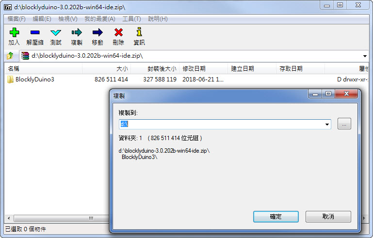
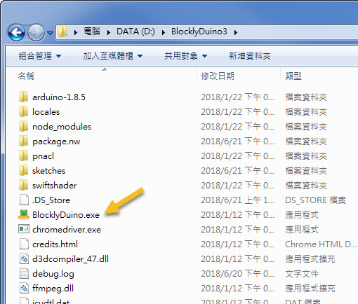
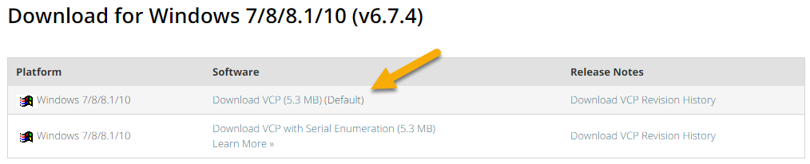
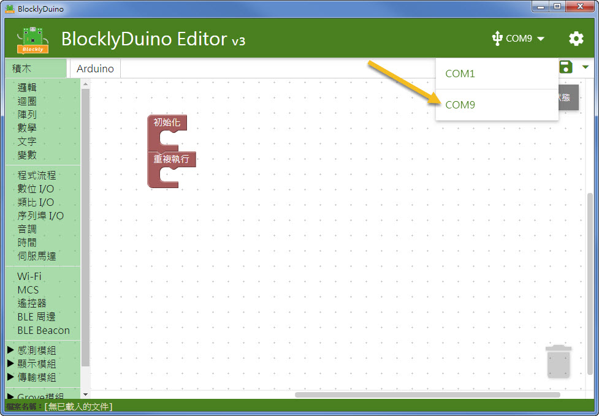
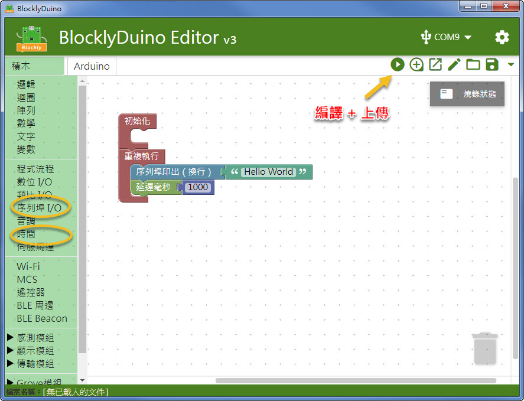
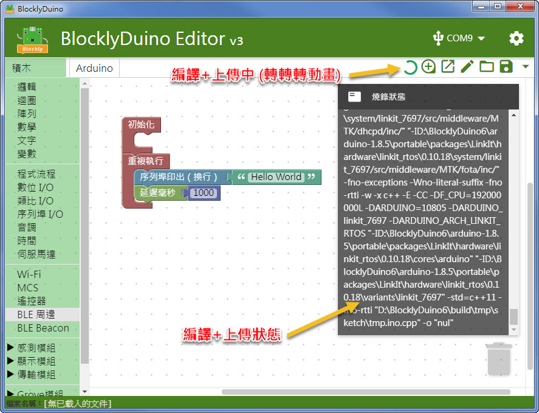
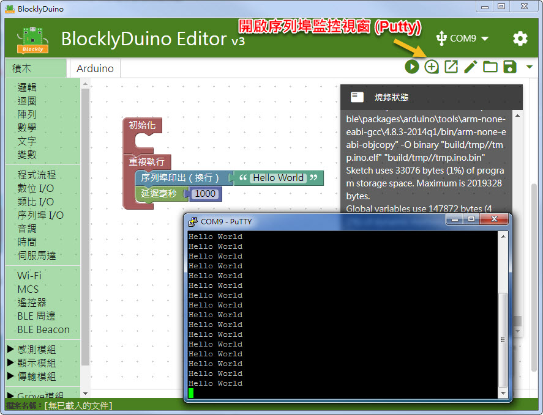

# 安裝開發環境 (v3)


此為 LinkIt 7697 BlocklyDuino v3 新功能, 預計於七月初 BETA 版


### 下載並安裝 BlocklyDuino v3 (綠色軟體) 

1. 下載後請解壓縮到目的路徑


此包為綠色軟體包，內容物的路徑比較深，可能會造成編譯時的錯誤，且錯誤很隱諱不易察覺。請解壓縮時注意以下兩點:

1. 擺放路徑越短越好, 盡量就解壓縮在根目錄下
2. 有些解壓縮軟體對於過長路徑會產生錯誤(例如某些版本的 WinRAR)， 可以使用免費的 [7-zip](https://www.7-zip.org) 來解壓縮



2.在 BlocklyDuino3 的檔案夾內，可以找到 BlcoklDuino.exe，點擊即可執行

### 下載並安裝 USB-UART 驅動 

 1\. 下載並安裝 CP2102N 驅動程式。 CP2102N 是 LinkIt 7697 開發板上的 USB 轉 UART 晶片， 透過此晶片來連接 PC


請選擇符合您使用平台的驅動程式來安裝:



2.透過 micro-USB 連接開發板， 可看到板上的 PWR LED 點亮，表示開發板有被正確供電

### 選擇 Com Port 

1\. 選取插上 LinkIt 7697 後新增的 Com Port

### 我的第一個程式 Hello World 

1\. 從左邊的 **序列埠 I/O** 和 **時間 **內拉出積木，印出 Hello World

2\. 按下右上方的 **編譯+上傳** 按鈕

3\. 此時可看到一個 **編譯+上傳 **執行中的動畫，也可點開燒錄狀態看執行的 log

4\. 上傳完成後，程式就會自動開始執行。可按上面的 **開啟監控視窗按鈕**，可以看到每一秒印出一個 Hello World

