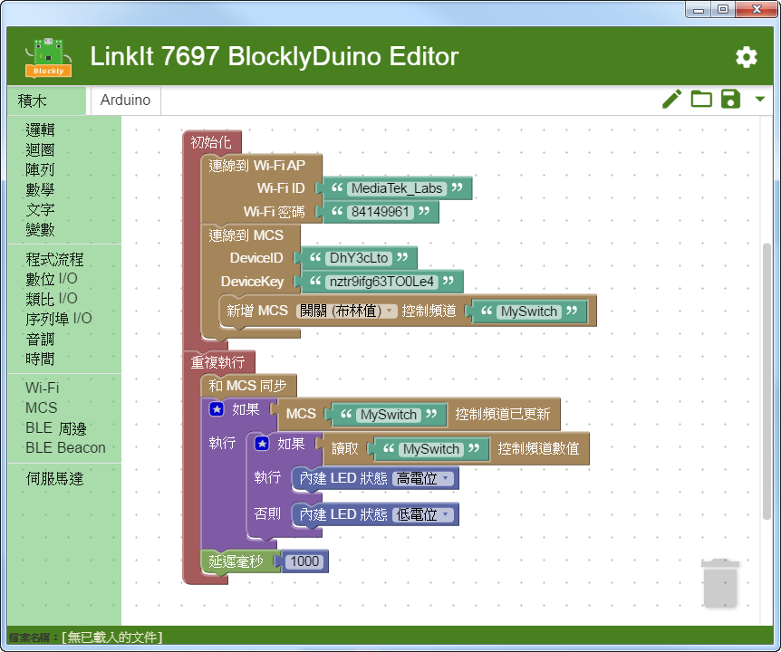
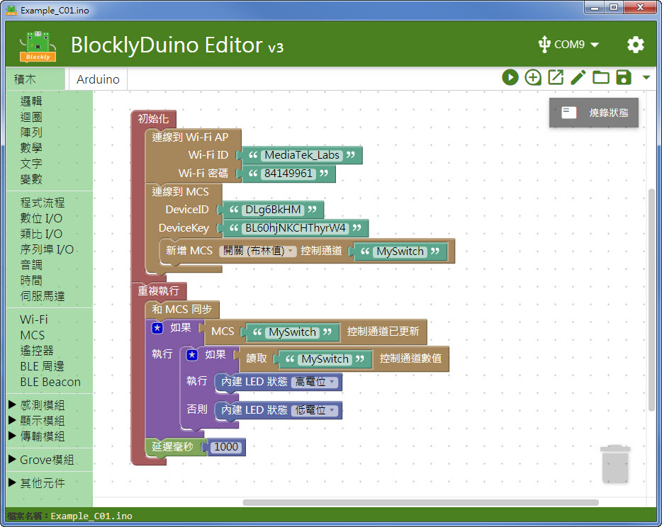

# BlocklyDuino v2 & v3 比較

＊BlocklyDuino v3 將於七月初 Release

簡易比較表如下:

|             | BlocklyDuino v2                                                                       | BlocklyDuino v3                                                                                       |
| ----------- | ------------------------------------------------------------------------------------- | ----------------------------------------------------------------------------------------------------- |
| 發佈時間        | 2017/06                                                                               | 2018/07 (預計)                                                                                          |
| 編譯環境        | 需另外安裝 Arduino IDE，於 IDE 內編譯                                                           | 編譯環境整合入 BlocklyDuino 開發包內                                                                             |
| Arduino IDE | 手動開啟                                                                                  | 可於 BlocklyDuino 內一鍵開啟                                                                                 |
| 周邊程式庫       | 驅動或函式庫需另於 Arduino IDE 內另外安裝                                                           | 預裝所有支持積木的驅動或函式庫                                                                                       |
| 序列埠監視器      | 使用 Arduino IDE 的序列埠監視器，需於 Arudino 內開起                                                 | 整合 Putty，可於 BlocklyDuino 內一鍵開啟                                                                        |
| 周邊支持        | <ul><li>基礎 Digital / Analog / PWM 等 IO 元件</li><li>Grove Starter Kit 套件</li></ul>      | <ul><li>基礎 Digital / Analog / PWM 等 IO 元件</li><li>Grove Starter Kit 套件</li><li>常用感測/顯示/傳輸模組</li></ul> |
| 聯網支持        | <ul><li>Wi-Fi</li><li>MCS</li><li>BLE</li></ul>                                       | <ul><li>Wi-Fi</li><li>MCS</li><li>BLE</li><li>LinkIt Remote (手機搖控)</li></ul>                          |
| 支持 OS       | <ul><li>Windows</li><li>MacOS</li><li>Linux</li></ul>                                 | <ul><li>Windows</li></ul>                                                                             |
| 下載          | [下載連結](https://github.com/MediaTek-Labs/BlocklyDuino-for-LinkIt/releases/tag/v2.17.0) | [下載連結](https://github.com/MediaTek-Labs/BlocklyDuino-for-LinkIt/releases) (BETA)                      |
|             |                                                   |                                                                  |

\
\
\
\
