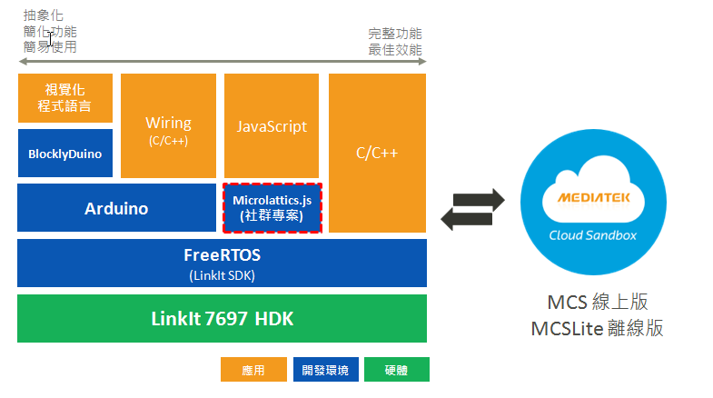

# 認識 LinkIt 7697

此開發板提供了多樣性的開發環境：

* [**FreeRTOS**](https://docs.labs.mediatek.com/resource/mt7687-mt7697/en/get-started-linkit-7697-hdk) : 專業開發者可使用 LinkIt SDK， 搭配 GCC/IAR/Keil 來開發。 使用 LinkIt SDK 可提供最佳的效能和更多的客製化彈性
* [**Arduino**](https://docs.labs.mediatek.com/resource/linkit7697-arduino/en/setup-arduino-ide-for-linkit-7697): 相容於提供給 Maker、教育， 以及 Fast Prototyping 使用
* [**BlocklyDuino**](https://github.com/MediaTek-Labs/BlocklyDuino-for-LinkIt):視覺化程式語言， 把複雜的功能和語法做了抽象化， 更簡易使用。編輯器且會將視覺化積木轉換成 Arduino 的程式，可當作學習 Arduino 的橋梁
* [**Microlattice.js**](https://www.gitbook.com/book/iamblue/microlattice-js-for-linkit-rtos/details) : 此為社群專案， 提供使用 JavaScript 的開發環境

搭配聯發科技提供的免費雲平台 [**MCS**](https://mcs.mediatek.com/zh-TW/) (線上版) 和 [**MCSLite**](http://mcs-lite-introduction.netlify.com/zh-tw/) (離線版， 開源)， 可以快速學習和實作整套互動式物聯網應用

### 開發板硬體配置 

板子上最常用的硬件如下:

* **RST **按鈕 : 按下就會重新啟動開發板
* **USR **按鈕 : 板子上內建的輸入按鈕
* **UART RX** LED : 序列埠往板子傳資料時會閃爍
* **UART TX LED**:  序列埠往 PC 傳資料時會閃爍
* **Micro-USB **: 透過 Micro-USB 線和電腦連接，主要用於下載程式和透過序列埠來列印 logs


欲更了解這開發板，請下載 [User Guide of LinkIt 7697](https://labs.mediatek.com/en/download/AAdtKvL9)


### 針腳的功能 

開發板的針腳會有不同功能，請參考 pinout diagram 了解各腳位的功能 ([下載 pdf 版本](https://labs.mediatek.com/en/download/1ega2lbl))

