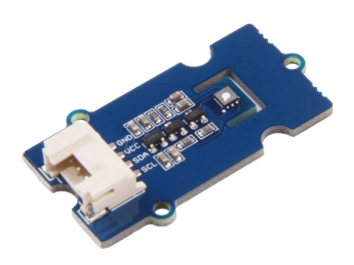
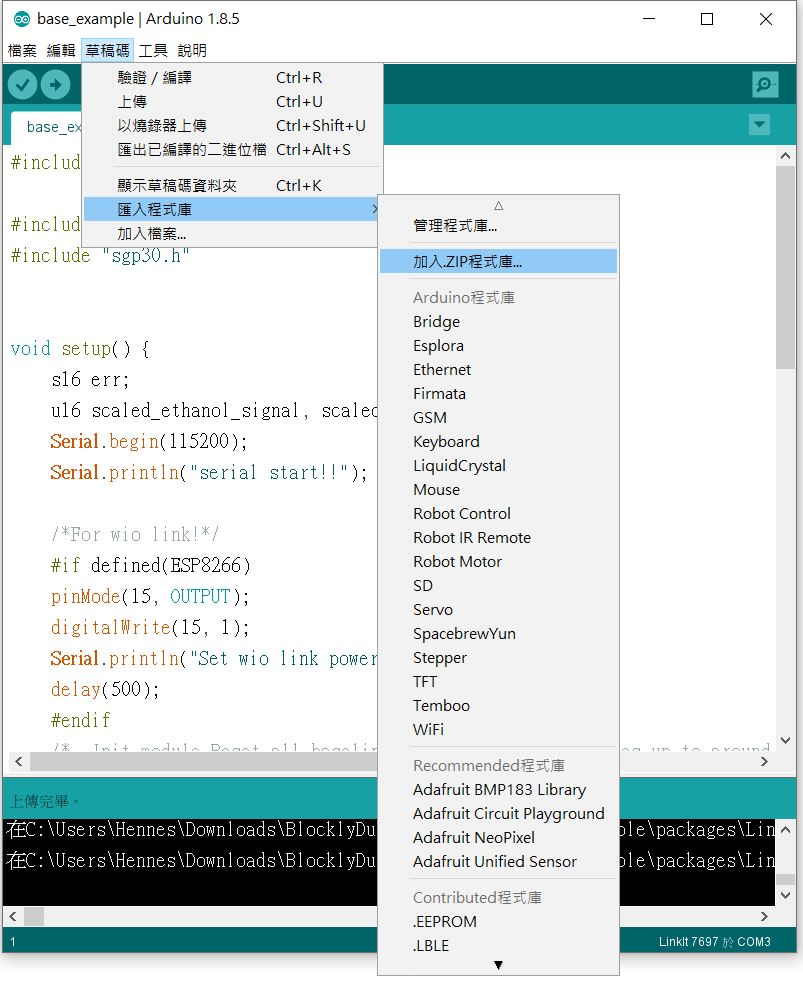

# Grove–VOC與eCO2 氣體感測器 \(SGP30\)



### **專案說明**

**使用「LinkIt 7697 NANO Breakout」連接「Grove–VOC與eCO2 氣體感測器」,讀取Grove–VOC與eCO2 氣體感測器數值變化。**

**此Grove–VOC與eCO2 氣體感測器包含於「**[**Grove – VOC與eCO2 氣體感測器 VOC and eCO2 Gas Sensor \(SGP30\)**](https://robotkingdom.com.tw/product/grove-voc-and-eco2-gas-sensor-sgp30/)**」內。**

### **LinkIt 7697 電路圖**

* [**LinkIt 7697**](https://www.robotkingdom.com.tw/product/linkit-7697/)
* **LinkIt 7697 NANO Breakout**
* **Grove–VOC與eCO2 氣體感測器**

**Grove–VOC與eCO2 氣體感測器**是**I2C訊號**輸出， 可以接「I2C」的 LinkIt 7697 NANO Breakout訊號端上。 本範例連接到「**I2C**」，「**SDA**」**←→**「**SDA**」，「**SCL**」**←→**「**SCL**」。


### Arduino 程式

由於Grove–VOC與eCO2 氣體感測器是函式庫型模組，所以需要先在Arduino上下載函式庫，下載方法如下。 首先先從github上下載Seeed SGP30 library 函式庫，從草稿碼選項中匯入ZIP檔程式庫。\(如下圖\)  
****[https://github.com/Seeed-Studio/SGP30\_Gas\_Sensor](https://github.com/Seeed-Studio/SGP30_Gas_Sensor)



原廠詳細資料如下: [https://wiki.seeedstudio.com/cn/Grove-VOC\_and\_eCO2\_Gas\_Sensor-SGP30/](https://wiki.seeedstudio.com/cn/Grove-VOC_and_eCO2_Gas_Sensor-SGP30/)

```text
#include <Arduino.h>

#include "sensirion_common.h"
#include "sgp30.h"


void setup() {
    s16 err;
    u16 scaled_ethanol_signal, scaled_h2_signal;
    Serial.begin(115200);
    Serial.println("serial start!!");

    /*For wio link!*/
    #if defined(ESP8266)
    pinMode(15, OUTPUT);
    digitalWrite(15, 1);
    Serial.println("Set wio link power!");
    delay(500);
    #endif
    /*  Init module,Reset all baseline,The initialization takes up to around 15 seconds, during which
        all APIs measuring IAQ(Indoor air quality ) output will not change.Default value is 400(ppm) for co2,0(ppb) for tvoc*/
    while (sgp_probe() != STATUS_OK) {
        Serial.println("SGP failed");
        while (1);
    }
    /*Read H2 and Ethanol signal in the way of blocking*/
    err = sgp_measure_signals_blocking_read(&scaled_ethanol_signal,
                                            &scaled_h2_signal);
    if (err == STATUS_OK) {
        Serial.println("get ram signal!");
    } else {
        Serial.println("error reading signals");
    }
    err = sgp_iaq_init();
    //
}

void loop() {
    s16 err = 0;
    u16 tvoc_ppb, co2_eq_ppm;
    err = sgp_measure_iaq_blocking_read(&tvoc_ppb, &co2_eq_ppm);
    if (err == STATUS_OK) {
        Serial.print("tVOC  Concentration:");
        Serial.print(tvoc_ppb);
        Serial.println("ppb");

        Serial.print("CO2eq Concentration:");
        Serial.print(co2_eq_ppm);
        Serial.println("ppm");
    } else {
        Serial.println("error reading IAQ values\n");
    }
    delay(1000);
}
```

