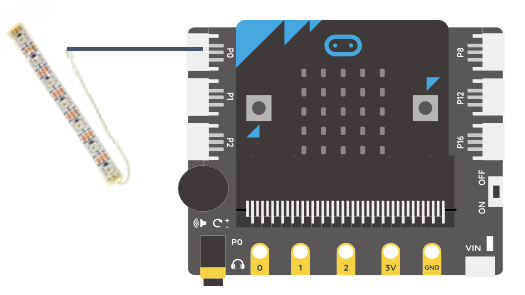
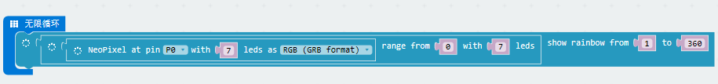
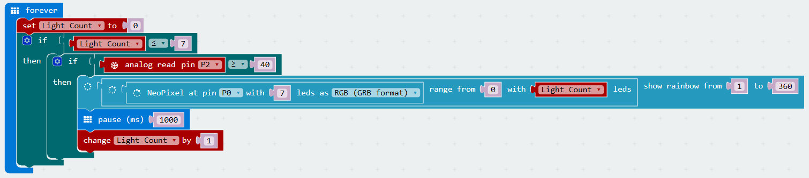
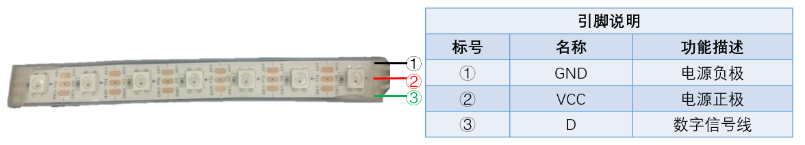

# 七彩燈條

## 实物图片

## 基本信息

中文名称：七彩灯带

英文名称：RGB LED strip

序号：

SKU 号：019.00268

## 模块简介

七彩灯带属于简单的发光模块，可以通过调节色彩调出不同颜色的灯效，可广泛应用于建筑物、桥梁、道路、花园、庭院、地板等领域的装饰照明与会场布置、圣诞节、万圣节、情人节、复活节、国庆节等节日期间烘托气氛等场景。

## 使用说明

在使用七彩灯带之前，需要扩展灯带的指令库。打开makecode编程平台，滚动至指令区最底部，依次点击高级----添加软件包----neopixel，完成Neopixel指令的调用，此时指令区会出现neopixel模块。完成以上步骤以后，将灯带连接至micro:bit板，即可通过编程控制灯带效果。

## 原理介绍

七彩灯带由7颗彩色LED灯组成，采用柔性线路板即FPC来做载体，灯泡与电路被完全包覆在柔性塑料中，绝缘、防水性能好，使用安全，支持5V供电。

## 应用样例

### **\(1\) 点亮七彩灯带**

**样例说明：** 通过编写程序，将程序烧录至板子后，可以控制七彩灯带点亮并呈现七彩的效果。

**元件清单：** 七彩灯带；micro:bit；micro:bit BOSON扩展板。

**连线图：** 将七彩灯带连接至micro:bit扩展板引脚P0。

**设计意图：** 控制七彩灯带点亮并呈现七彩的效果。

① 选定七彩灯带连接micro:bit的引脚、灯带LED灯的数目及颜色模式，指令语句如下图。此处七彩灯带至micro:bit扩展板引脚P0，灯带LED灯数目为7盏，颜色模式为RGB模式。

② 确定七彩灯带中LED灯使用的范围，需要调用的指令如下图。此处七彩灯带中LED灯使用范围为0-7。

③ 确定七彩灯带色调范围，需要调用的指令如下图。此处色调范围为1-360（红色-绿色-蓝色）。

最终程序如下。

**程序示意图（中文版）：**

**程序示意图（英文版）：**

### **\(2\) 声控灯带**

**样例说明：** 通过声音控制七彩灯带中LED灯的点亮数目。

**元件清单：** 七彩灯带；声音传感器；micro:bit；micro:bit BOSON扩展板。

**连线图：** 将七彩灯带连接至micro:bit扩展板引脚P0，声音传感器连接至micro:bit扩展板引脚P2。

**执行流程：**

① 设置七彩灯带最初为熄灭状态。

② 判断点亮LED灯的数目是否小于等于7盏，满足条件则继续判断声音传感器检测到的声音强度是否大于等于40。

③ 如果以上条件均满足，则点亮一盏LED灯，暂停1秒。否则，灯带保持点亮部分小灯状态不变。

④ 重复第②步，继续判断②中的条件是否满足。

**程序示意图（中文版）：**

**程序示意图（英文版）：**

## 规格参数

引脚说明： 

尺寸:

工作电压:

