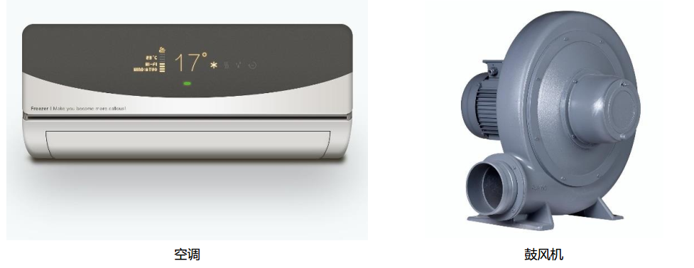

# o9馬達模組

## 實體圖片

## 基本資訊

中文名稱：馬達模組

英文名稱：Motor Controller Module

序号：o9

SKU 号：BOS0024

## 模組介紹

馬達模組可以控制小車移動、推動輸送帶、帶動滑輪裝置。與風扇模組中的馬達相比，在實現複雜功能時，僅僅依靠馬達的單方向轉動是不夠的，我們需要通過馬達模組來設定馬達的轉速與方向。馬達模組已被廣泛應用於空調、吸塵器、鼓風機、壓縮機、驅動機床、電扇、電冰箱、水泵等場景中。

## 使用说明

馬達模組预设了四种不同的控制模式（如下表所示），可以通过拨动开关进行切换。

电机的转动方向如下图所示：

按照下图所示连接电路，通电后即可通过电机控制模块上的拨动开关控制电机的转速和方向。

## 原理介绍

电机驱动物体运动的过程是一个电能转化为动能的过程，需要耗费较大的能量，而输入模块与电机直接相连无法直接提供足够的功率。为了保证有足够能量维持电机转动，在使用时我们需要通过电机控制模块将信号转化为电机的驱动电流。

## 應用範例

### **\(1\) 制作风车**

**範例说明：** 用声音传感器和电机控制模块模拟风车，当人对着声音传感器说话或吹气时，观察电机的转速和转动方向。

**元件清单：** 声音传感器；电机控制模块；N20减速电机模块；micro:bit；micro:bit BOSON扩展板。

**连线图：** 将声音传感器连接至micro:bit扩展板引脚P0，电机控制模块及电机模块连接至micro:bit扩展板引脚P8。

**执行流程：**

① 读取引脚P0的声音强度值。

② 将读取到的强度值赋给引脚P8，通过开关切换4种控制模式，观察不同模式下电机的转速与方向，制作不同转速与方向的风车。

**程序示意图（中文版）：**

**程序示意图（英文版）：**

### **\(2\) 调速打蛋器（非编程）**

**样例说明：** 制作一个打蛋器，打蛋器的打蛋头固定在电机的转轴上，使用旋钮模块控制电机的转速和转动方向。

**元件清单：** 旋钮模块；电机控制模块；N20减速电机模块；电源主板-单路。

**连线图：**

### **\(3\) 调速打蛋器（编程）**

**样例说明：** 制作一个打蛋器，打蛋器的打蛋头固定在电机的转轴上，使用旋钮模块控制电机的转速和转动方向。

**元件清单：** 旋钮模块；电机控制模块；N20减速电机模块；micro:bit；micro:bit BOSON扩展板。

**连线图：** 将旋钮模块连接至micro:bit扩展板引脚P0，电机控制模块及电机模块连接至micro:bit扩展板引脚P8。

**执行流程：**

① 读取引脚P0的声音强度值。

② 将读取到的强度值赋给引脚P8，通过开关切换4种控制模式，观察不同模式下电机的转速与方向，制作不同转速与方向的打蛋器。

**程序示意图（中文版）：**

**程序示意图（英文版）：**

## 规格参数

引脚说明：

尺寸: 26mm\*22mm

工作电压:3.3V-5.0V

工作电流：10mA

