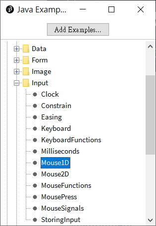
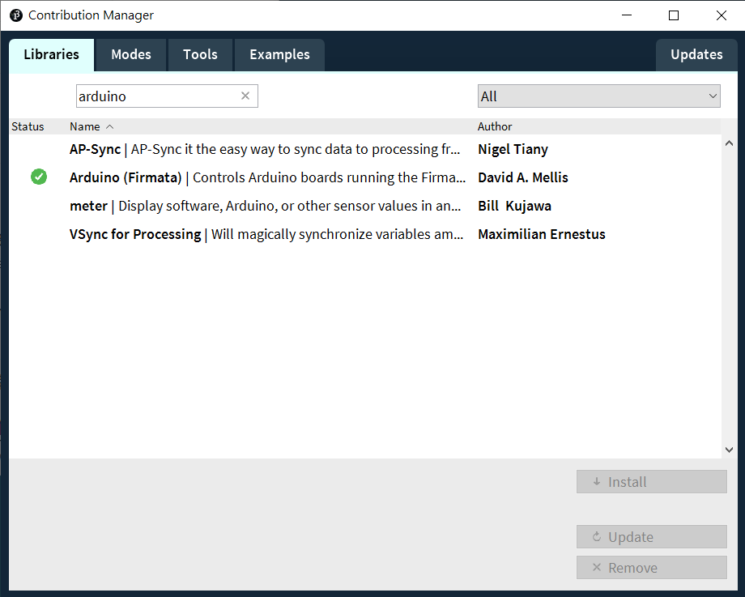
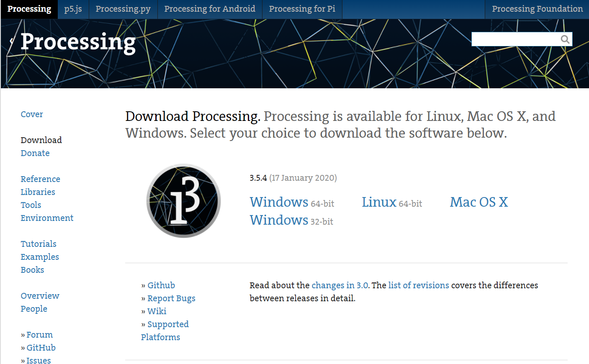

# 範例02\_Arduino 函式庫安裝，可變電阻控制圈圈大小

歡迎來到第一個範例！

首先請取得 Arduino 1.8.5，並安裝好驅動程式之後燒錄 \[StandardFirmata\] 程式，這個小程式可以回應來自外部的所有呼叫。是相當好用的範例，當然也有其限制，後續會再深入說明。範例路徑為：<b>File / Examples / Firmata / StandardFirmata</b>
<br/>

接著要在設定 Processing IDE中設定 Arduino 函式庫。請開啟 Contribution Manager(<b>Sketch / Import Library... / Add Library...</b>)
<br/>

新增一個 Processing 專案，並輸入以下程式碼，確認 Arduino 首次接觸就上手套件已正確燒錄 [StandardFirmata 程式](https://www.arduino.cc/en/reference/firmata)。
輸入完成直接執行以下 pde，會看到以下執行畫面：

<b>按鈕未按下，可變電阻值 < 800</b><br/>


<b>按鈕按下，可變電阻值 > 800</b><br/>


## Processing程式 - arduino_input_easy.pde
<br/>
```text
import processing.serial.*;
import cc.arduino.*;

Arduino arduino;

color off = color(4, 79, 111);
color on = color(84, 145, 158);

void setup() {
  size(470, 280);

  // Prints out the available serial ports.
  println(Arduino.list());
  arduino = new Arduino(this, Arduino.list()[0], 57600);
  arduino.pinMode(6, Arduino.INPUT);
}

void draw() {
  background(off);
  stroke(on);

  if (arduino.digitalRead(6) == Arduino.HIGH) {
    fill(on);
  } else {
    fill(off);
    rect(400, 30, 50, 50);
  }

  if (arduino.analogRead(0) > 800) {
    fill(229, 53, 53);
  } else {
    fill(152, 219, 31);
  }
  ellipse(280, 160, arduino.analogRead(0) / 8, arduino.analogRead(0) / 8);
}

```
