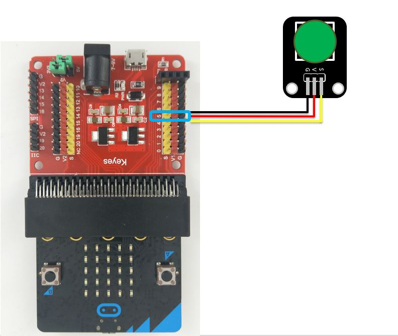

# 按鈕模組

## LinkIt 7697 專案說明

使用「LinkIt 7697 NANO Breakout」連接「按鈕模組」， 讀取按鈕模組按下或放開的狀態。

此**按鈕模組**包含於「[**洞洞么教學材料包**](https://www.robotkingdom.com.tw/product/rk-education-kit-001/) 」內。

### LinkIt 7697 電路圖

* [LinkIt 7697](https://www.robotkingdom.com.tw/product/linkit-7697/)
* LinkIt 7697 NANO Breakout
* 按鈕模組

**按鈕模組**是**數位訊號**輸入， 可以接「D0 \~ D13」的 LinkIt 7697 NANO Breakout訊號端上。 本範例連接到「**D5**」。


### BlocklyDuino 積木畫布

每0.2秒鐘會讀取按鈕模組狀態一次， 並可透過序列埠監控視窗看到按鈕模組的狀態 。


.png>)

### Arduino 程式

```c
void setup()
{
  pinMode(5, INPUT);
  Serial.begin(9600);
}

void loop()
{
  Serial.println(digitalRead(5));
  delay(200);
}
```

## micro:bit 專案說明

使用「micro:bit搭配科易KEYES micro:bit 感測器擴充板 V2」連接「按鈕模組」，讀取按鈕模組按下或放開的狀態。

此**按鈕模組**包含於「[**洞洞么教學材料包**](https://www.robotkingdom.com.tw/product/rk-education-kit-001/)」內。

### micro:bit 電路圖

* [BBC micro:bit 微控制板
  ](https://www.robotkingdom.com.tw/product/bbc-microbit-1/)
* [科易KEYES micro:bit 感測器擴充板 V2
  ](https://www.robotkingdom.com.tw/product/keyes-microbit-sensor-breakout-v2/)
* 按鈕模組

**按鈕模組**是**數位訊號**輸入， 可以接「3、4、5、6、7、9、10、11」的 micro:bit訊號端上，建議使用的是5跟11腳位，因為3、4、6、7、9、10腳位有使用到LED控制腳位所以當顯示LED時會不穩定。 本範例連接到「**P5**」。



### Microsoft MakeCode積木畫布

每1秒鐘會讀取按鈕模組狀態一次，並可透過micro:bit顯示指示燈看到按鈕模組的狀態。

 (1).JPG>)

### JavaScript 程式

```javascript
basic.forever(function () {
    basic.showNumber(pins.digitalReadPin(DigitalPin.P5))
    basic.pause(1000)
})
```


## Raspberry Pi Pico 專案說明

使用「Raspberry Pi Pico」連接「按鈕模組」, 讀取按鈕模組按下或放開的狀態。此**按鈕模組**包含於「[洞洞么教學材料包](https://robotkingdom.com.tw/product/rk-education-kit-001/)」內。


### 按鈕模組電路圖

* [Raspberry Pi Pico](https://robotkingdom.com.tw/product/raspberry-pi-pico/)[
  ](https://www.robotkingdom.com.tw/product/bbc-microbit-1/)
* [Raspberry Pi Pico擴充板](https://robotkingdom.com.tw/product/pipico-education-kit-001/)[
  ](https://www.robotkingdom.com.tw/product/keyes-microbit-sensor-breakout-v2/)
* 按鈕模組

> **按鈕模組**是**數位訊號**輸入， 可以接「D0 \~ D28」的Raspberry Pi Pico擴充板訊號端上。 本範例連接到「D7」。

&#x20;

<figure><figcaption></figcaption></figure>

### Arduino IDE程式

> 每0.2秒鐘會讀取按鈕模組狀態一次， 並可透過序列埠監控視窗看到按鈕模組的狀態 。
>
>

Arduino 程式(Button.ino)如下:

```arduino
void setup()
{
  pinMode(7, INPUT);
  Serial.begin(9600);
}

void loop()
{
  Serial.println(digitalRead(7));
  delay(200);
}
```


### **程式執行結果**

<figure><figcaption></figcaption></figure>
