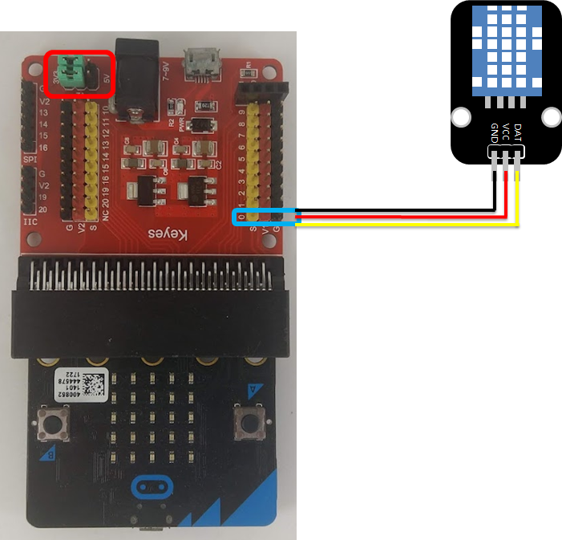
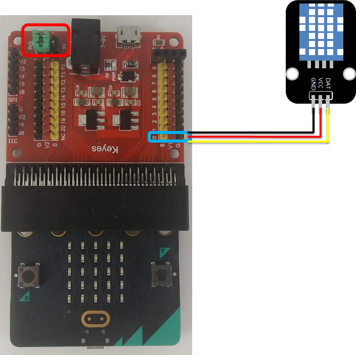

# DHT11溫溼度感測器模組


## LinkIt 7697 專案說明

使用「LinkIt 7697 NANO Breakout」連接「DHT11溫溼度感測器模組」， 每1秒讀取DHT11溫溼度感測器模組溫度和濕度數值 。

此**DHT11溫溼度感測器模組**包含於「[**洞洞么教學材料包**](https://www.robotkingdom.com.tw/product/rk-education-kit-001/) 」內。

### LinkIt 7697 電路圖

* [LinkIt 7697](https://www.robotkingdom.com.tw/product/linkit-7697/)
* LinkIt 7697 NANO Breakout
* DHT11溫溼度感測器模組

**DHT11溫溼度感測器模組**是**數位訊號**輸出， 可以接「D2」的 LinkIt 7697 NANO Breakout訊號端上。 本範例連接到「**D2**」。


### BlocklyDuino 積木畫布

每秒鐘讀取DHT溫溼度感測器的溫度和濕度一次，並顯示在序列埠監控視窗上。


### Arduino 程式

```c
#include <DHT.h>
DHT dht11_p2(2, DHT11);

void setup()
{
  Serial.begin(9600);
  dht11_p2.begin();
}

void loop()
{
  Serial.print("溫度：");
  Serial.println(dht11_p2.readTemperature());
  Serial.print("濕度：");
  Serial.println(dht11_p2.readHumidity());
  delay(1000);
}
```

## micro:bit 專案說明

使用「micro:bit搭配科易KEYES micro:bit 感測器擴充板 V2」連接「DHT11溫溼度感應器模組」, 每1秒讀取DHT11溫溼度應器模組溫度和濕度數值 。

此**DHT11溫溼度感應器模組**包含於「[**洞洞么教學材料包**](https://www.robotkingdom.com.tw/product/rk-education-kit-001/)」內。

### micro:bit電路圖

* [BBC micro:bit 微控制板
  ](https://www.robotkingdom.com.tw/product/bbc-microbit-1/)
* [科易KEYES micro:bit 感測器擴充板 V2
  ](https://www.robotkingdom.com.tw/product/keyes-microbit-sensor-breakout-v2/)
* DHT11溫溼度感應器模組

**DHT11溫溼度感應器模組**是**數位訊號**輸出， 可以接「0、 1、 2、 8、 12、13、14、 15、 16、 19、20」的 micro:bit訊號端上，建議使用的是0、1、2腳位。本範例連接到「**P0**」。



### Microsoft MakeCode積木畫布 \(適用microbit v1.5\)


注意:  
測試時發現電壓如果切換到5V時會發生無法正常顯示溫、濕度的問題、請記得把V1切到3V3當中\(如上圖紅框處\)  
以下程式及函式庫目前測試不適用於micro:bit v2，如需再micro:bit v2使用請使用下方另一個函式庫的程式。


在使用DHT11溫溼度感應器之前，需要擴展DHT11溫溼度感應器的指令庫。打開makecode程式設計平臺，滾動至指令區最底部，依序點擊進階----擴展，並使用以下網址安裝套件。

DHT11溫溼度感應器套件安裝網址：[https://github.com/lioujj/pxt-sensors
](https://github.com/lioujj/pxt-sensors)


每按下A或B按鈕會讀取並顯示DHT11溫溼度感應器的溫度和濕度一次，並可透過micro:bit顯示指示燈看到DHT11溫溼度感應器的溫度和濕度的狀態。


### JavaScript 程式

```javascript
let temp = 0
let humi = 0
input.onButtonPressed(Button.A, function () {
    temp = sensors.get_DHT11_value(
    DigitalPin.P0,
    sensors.Dht11Result.Celsius
    )
    basic.showString("TEMP:")
    basic.showNumber(temp)
})
input.onButtonPressed(Button.B, function () {
    humi = sensors.get_DHT11_value(
    DigitalPin.P0,
    sensors.Dht11Result.humidity
    )
    basic.showString("HUMI:")
    basic.showNumber(humi)
})
basic.forever(function () {
    
})
```

## microbit v2\(DHT11更新函式庫\)

### micro:bit電路圖

* [BBC micro:bit 微控制板
  ](https://www.robotkingdom.com.tw/product/bbc-microbit-1/)
* [科易KEYES micro:bit 感測器擴充板 V2
  ](https://www.robotkingdom.com.tw/product/keyes-microbit-sensor-breakout-v2/)
* DHT11溫溼度感應器模組

**DHT11溫溼度感應器模組**是**數位訊號**輸出， 可以接「0、 1、 2、 8、 12、13、14、 15、 16、 19、20」的 micro:bit訊號端上，建議使用的是0、1、2腳位。本範例連接到「**P0**」。




注意:  
測試時發現電壓如果切換到5V時會發生無法正常顯示溫、濕度的問題、請記得把V1切到3V3當中\(如上圖紅框處\)。  
以下函式庫測試後適用於micro:bit v2，一開始如果溫、濕度顯示-999.0為正常，請等程式驗證後即可正常顯示溫、濕度，如還是無法正常顯示可以嘗試將MICRO USB供電改為擴充版供電、或是按板子背後的RESET鈕試試看。


在使用DHT11溫溼度感應器之前，需要擴展DHT11溫溼度感應器的指令庫。打開makecode程式設計平臺，滾動至指令區最底部，依序點擊進階----擴展，並使用以下網址安裝套件。

DHT11溫溼度感應器套件安裝網址：[https://github.com/alankrantas/pxt-DHT11\_DHT22](https://github.com/alankrantas/pxt-DHT11_DHT22)


新增後在上方可以看見增加的DHT11/DHT22套件


### Microsoft MakeCode積木畫布 \(適用microbit v2\)

### 


