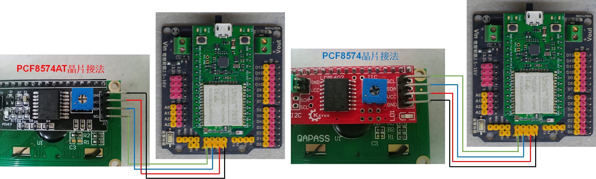
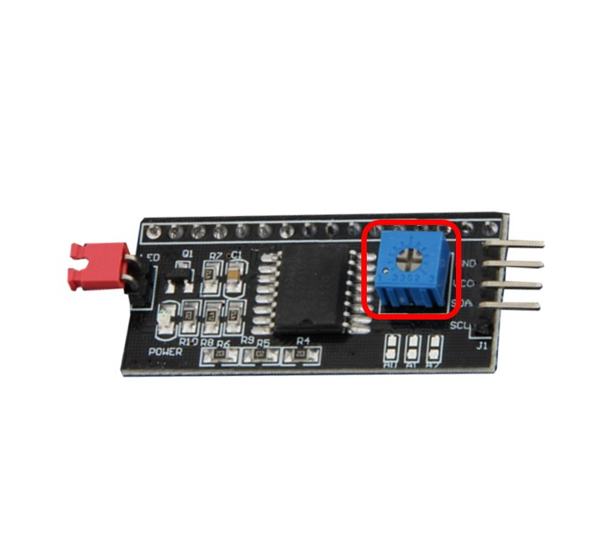
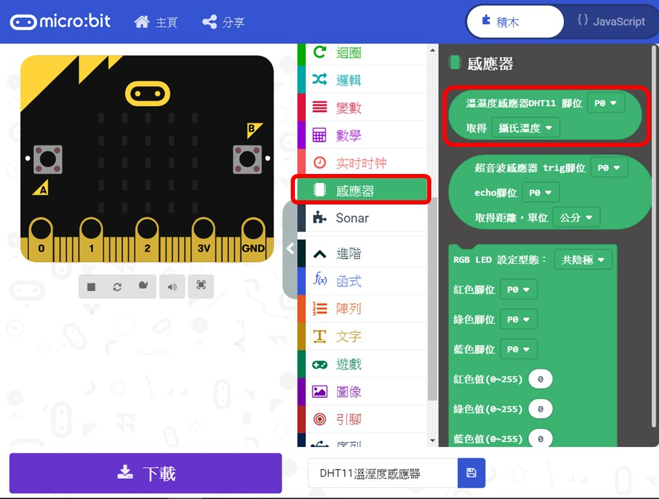

# I2C 1602液晶顯示模組



請先按照以下順序檢查I2C液晶顯示模組是否接線正確，程式是否寫對再進行使用。

1． 將I2C液晶顯示模組轉到背面，並檢查晶片的型號， I2C 液晶顯示模組有PCF8574及PCF8574A這二種晶片。  
2． 將I2C液晶顯示模組轉到背面，並檢查線的位置是否接對。不同晶片的腳位順序會不一樣。  
3．根據晶片型號更改程式碼裡的I2C位址，PCF8574晶片初始化I2C位址為0x27；PCF8574A晶片初始化I2C位址為0x3F。

詳細確認方法位置請參考以下圖片紅框、藍框處



## LinkIt 7697 專案說明

使用「LinkIt 7697 NANO Breakout」連接「I2C 1602液晶顯示模組」，在I2C 1602 液晶顯示模組上顯示「Hello World」。

此**I2C 1602液晶顯示模組**包含於「[**洞洞么教學材料包**](https://www.robotkingdom.com.tw/product/rk-education-kit-001/) 」內。

### LinkIt 7697 電路圖

* [LinkIt 7697](https://www.robotkingdom.com.tw/product/linkit-7697/)
* LinkIt 7697 NANO Breakout
* I2C 1602液晶顯示模組

**I2C 1602液晶顯示模組**是**I2C訊號**輸出， 可以接「I2C」的 LinkIt 7697 NANO Breakout訊號端上。 本範例連接到「**I2C**」，「**SDA**」**←→**「**SDA**」，「**SCL**」**←→**「**SCL**」。


I2C 液晶顯示模組有PCF8574及PCF8574A這二種晶片，而其中PCF8574晶片初始化I2C位址為0x27；PCF8574A晶片初始化I2C位址為0x3F。

如發現液晶顯示模組有沒有正常顯示畫面，另一個可能即是對比預設調整太低，轉動模組背後的可變電阻\(如下圖紅框處\)把對比值調整至可看清楚之閥值即可顯示畫面。  
  
如發現液晶顯示模組有沒有正常顯示畫面，但程式I2C設定也正確，亮度也調整過，可以試試看按7697的RST鈕，讓板子重新啟動，會重新跑一次I2C的設定讓螢幕可正常顯示。





如發現液晶顯示模組有沒有正常顯示畫面，另一個可能即是對比預設調整太低，轉動模組背後的可變電阻（如下圖紅框處）把對比值調整至可看清楚之閾值即可顯示畫面。




### BlocklyDuino 積木畫布

在I2C 1602液晶顯示模組上顯示「Hello World」。


### Arduino 程式

```c
#include <LiquidCrystal_I2C.h>
LiquidCrystal_I2C lcd_i2c(0x3F);

void setup()
{
  lcd_i2c.begin(16, 2);
  lcd_i2c.backlight();
  lcd_i2c.clear();
  lcd_i2c.setCursor(0,0);
  lcd_i2c.print("Hello World");
}


void loop()
{

}
```

## micro:bit 專案說明

使用「micro:bit搭配科易KEYES micro:bit 感測器擴充板 V2」連接「I2C 1602液晶顯示模組」，在I2C 1602 液晶顯示模組上顯示「Hello World」。

此**I2C 1602液晶顯示模組**包含於「[**洞洞么教學材料包**](https://www.robotkingdom.com.tw/product/rk-education-kit-001/)」內。

### micro:bit電路圖

* [BBC micro:bit 微控制板
  ](https://www.robotkingdom.com.tw/product/bbc-microbit-1/)
* [科易KEYES micro:bit 感測器擴充板 V2
  ](https://www.robotkingdom.com.tw/product/keyes-microbit-sensor-breakout-v2/)
* I2C 1602液晶顯示模組

**I2C 1602液晶顯示模組**是**I2C訊號**輸出， 可以接「19、20」的 micro:bit訊號端上。 本範例連接到「P19、P20」。本範例連接到「**I2C**」，「**SDA**」←→「**P20**」，「**SCL**」←→「**P19**」


I2C 液晶顯示模組有PCF8574及PCF8574A這二種晶片，而其中PCF8574晶片初始化I2C位址為0x27；PCF8574A晶片初始化I2C位址為0x3F。

如發現液晶顯示模組有沒有正常顯示畫面，另一個可能即是對比預設調整太低，轉動模組背後的可變電阻\(如下圖紅框處\)把對比值調整至可看清楚之閥值即可顯示畫面。



### Microsoft MakeCode積木畫布

在使用I2C 1602液晶顯示模組之前，需要擴展I2C 1602液晶顯示模組的指令庫。打開makecode程式設計平臺，滾動至指令區最底部，依次點擊進階----擴展，並使用以下網址安裝套件。

I2C 1602液晶顯示模組套件安裝網址：[https://github.com/lioujj/pxt-lcd1602
](https://github.com/lioujj/pxt-lcd1602)




在I2C 1602液晶顯示模組上顯示「Hello World」 。


### JavaScript 程式

```javascript
lcd1602.setAddress(
lcd1602.I2C_ADDR.addr2
)
lcd1602.putString("Hello World", 0, 0)
basic.forever(function () {
    
})
```

