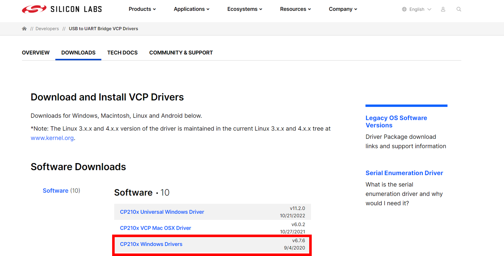

# 光敏模組


## LinkIt 7697 專案說明

使用「LinkIt 7697 NANO Breakout」連接「光敏模組」， 每0.5秒讀取光敏模組數值。

此**光敏模組**包含於「[**洞洞么教學材料包**](https://www.robotkingdom.com.tw/product/rk-education-kit-001/) 」內。

### LinkIt 7697 電路圖

* [LinkIt 7697](https://www.robotkingdom.com.tw/product/linkit-7697/)
* LinkIt 7697 NANO Breakout
* 光敏模組

**光敏模組**是**類比訊號**輸入， 可以接「A0 \~ A3」的 LinkIt 7697 NANO Breakout訊號端上，「A0 \~ A3」腳位在程式碼中以「14 \~ 17」表示。 本範例連接到「**A0**」，程式碼中為「**14**」。

 (1).png>)


### BlocklyDuino 積木畫布

每0.5秒鐘會讀取光敏模組一次， 並顯示在序列埠監控視窗上。

.png>)


### Arduino 程式

```c
void setup()
{
  Serial.begin(9600);
}

void loop()
{
  Serial.println(analogRead(14));
  delay(500);
}
```

## micro:bit 專案說明

使用「micro:bit搭配科易KEYES micro:bit 感測器擴充板 V2」連接「光敏模組」，讀取光敏模組的數值變化 。

此**光敏模組**包含於「[**洞洞么教學材料包**](https://www.robotkingdom.com.tw/product/rk-education-kit-001/) 」內。

### micro:bit電路圖

* [BBC micro:bit 微控制板
  ](https://www.robotkingdom.com.tw/product/bbc-microbit-1/)
* [科易KEYES micro:bit 感測器擴充板 V2
  ](https://www.robotkingdom.com.tw/product/keyes-microbit-sensor-breakout-v2/)
* 光敏模組

**光敏模組**是**類比訊號**輸入，可以接「0、1、2、3、4、10」的 micro:bit訊號端上，建議使用的是0、1、2腳位，因為3、4、10腳位有使用到LED控制腳位所以當顯示LED時會不穩定。本範例連接到「P0」。

 (1).JPG>)

### Microsoft MakeCode積木畫布

每1秒鐘會讀光敏模組的電位一次，並可透過micro:bit顯示指示燈看到光敏模組的電位數值。

.JPG>)

### JavaScript 程式

```javascript
basic.forever(function () {
    basic.showNumber(pins.analogReadPin(AnalogPin.P0))
    basic.pause(1000)
})
```


## Raspberry Pi Pico 專案說明

使用「Raspberry Pi Pico」連接「按鈕模組」, 讀取按鈕模組按下或放開的狀態。此 按鈕模組包含於「[洞洞么教學材料包](https://robotkingdom.com.tw/product/rk-education-kit-001/)」內。


### 光敏模組電路圖

* [Raspberry Pi Pico](https://robotkingdom.com.tw/product/raspberry-pi-pico/)[
  ](https://www.robotkingdom.com.tw/product/bbc-microbit-1/)
* [Raspberry Pi Pico擴充板](https://robotkingdom.com.tw/product/pipico-education-kit-001/)[
  ](https://www.robotkingdom.com.tw/product/keyes-microbit-sensor-breakout-v2/)
* 光敏模組

> **光敏模組**是**類比訊號**輸入， 可以接「A0\~ A2」的Raspberry Pi Pico擴充板訊號端上。 本範例連接到「A0」。

<figure><figcaption></figcaption></figure>


### Arduino IDE程式

> 每0.5秒鐘會讀取光敏模組一次， 並顯示在序列埠監控視窗上。


Arduino 程式(Photoresistor.ino)如下:

```arduino
void setup()
{
  Serial.begin(9600);
}

void loop()
{
  Serial.println(analogRead(A0));
  delay(500);
}
```

&#x20;

### **程式執行結果**

<figure><figcaption></figcaption></figure>
