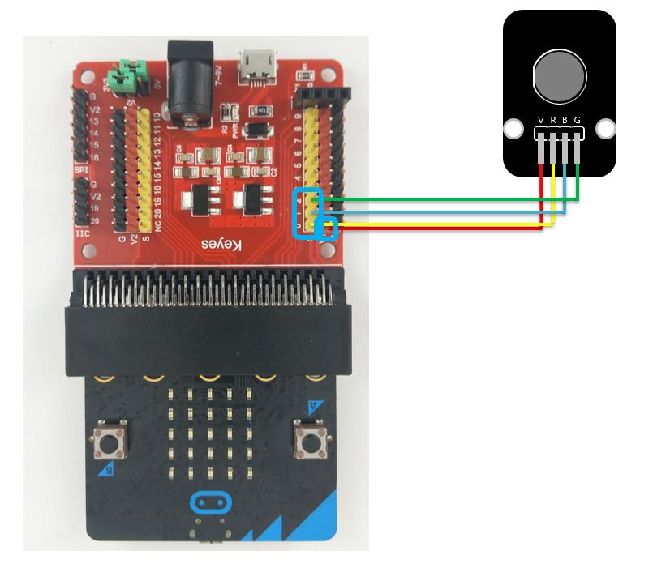
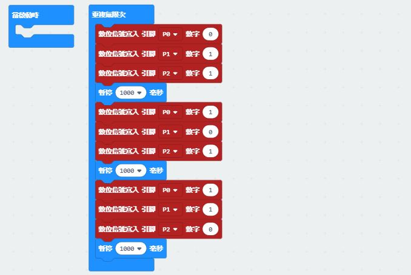

# LED模組（三色）


## LinkIt 7697 專案說明

使用「LinkIt 7697 NANO Breakout」連接「LED模組\(三色\)」，控制LED模組\(三色\) 每0.5秒依序發出紅光、綠光和藍光。

此**LED模組\(三色\)**包含於「[**洞洞么教學材料包**](https://www.robotkingdom.com.tw/product/rk-education-kit-001/) 」內。

### LinkIt 7697 電路圖

* [LinkIt 7697](https://www.robotkingdom.com.tw/product/linkit-7697/)
* LinkIt 7697 NANO Breakout
* LED模組\(三色\)

**LED模組\(三色\)**是**數位/類比訊號**輸出， 可以接「D0 ~ D13」的 LinkIt 7697 NANO Breakout訊號端上。 此範例使用的 LED模組\(三色\) 為共陽極 LED， 由下圖 把腳位V 接到 3.3V ~ 5V 的電源， 腳位 R / B / G （Red／Blue／Green）接到數位輸出腳位。


當 R / B / G 的腳位拉高到 3.3V/5V, 電流就不會流過, LED 就不會點亮 。  
當 R / B / G 的腳位拉低， 電流就會流過。 LED 就會點亮，本範例R / B / G連接到「**D2、D3、D4**」 。


### BlocklyDuino 積木畫布

透過控制數位腳位的高低電位來使 RBG 三色亮或暗。 此範例使用的是共陽極的 RGB 全彩 LED， 所以該顏色（R / B / G）對應的腳位（D2／D3／D4）為低電位狀態時， 電流才會流過並發亮。


### Arduino 程式

```c
void setup()
{
  pinMode(2, OUTPUT);
  pinMode(3, OUTPUT);
  pinMode(4, OUTPUT);
}

void loop()
{
  digitalWrite(2, LOW);
  digitalWrite(3, HIGH);
  digitalWrite(4, HIGH);
  delay(1000);
  digitalWrite(2, HIGH);
  digitalWrite(3, LOW);
  digitalWrite(4, HIGH);
  delay(1000);
  digitalWrite(2, HIGH);
  digitalWrite(3, HIGH);
  digitalWrite(4, LOW);
  delay(1000);
}
```

## micro:bit 專案說明

使用「micro:bit搭配科易KEYES micro:bit 感測器擴充板 V2」連接「LED模組（三色）」，每1秒控制LED模組（三色）呈現紅、綠和藍光。

此**LED模組（三色）**包含於「[**洞洞么教學材料包**](https://www.robotkingdom.com.tw/product/rk-education-kit-001/)」內。

### micro:bit 電路圖

* [BBC micro:bit 微控制板
  ](https://www.robotkingdom.com.tw/product/bbc-microbit-1/)
* [科易KEYES micro:bit 感測器擴充板 V2
  ](https://www.robotkingdom.com.tw/product/keyes-microbit-sensor-breakout-v2/)
* LED模組（三色）

LED模組（三色）是**數位/類比訊號**輸出， 可以接「P0 ~ P10」的 micro:bit訊號端上。此範例使用的 LED模組（三色） 為共陽極 LED， 由下圖 腳位V 的接到 3.3V ~ 5V 的電源， 腳位 R / B / G 接到數位輸出腳位


當 R / B / G 的腳位拉高到 3.3V/5V, 電流就不會流過, LED 就不會點亮

當 R / B / G 的腳位拉低， 電流就會流過。 LED 就會點亮本範例連接到「**P0**、**P1**、**P2**」



### Microsoft MakeCode積木畫布

透過控制數位腳位的高低電位來使 RBG 三色亮或暗。 此範例使用的是共陽極的 RGB 全彩 LED， 所以該顏色對應的腳位為低電位狀態時， 電流才會流過並發亮。



### JavaScript 程式

```javascript
basic.forever(function () {
    pins.digitalWritePin(DigitalPin.P0, 0)
    pins.digitalWritePin(DigitalPin.P1, 1)
    pins.digitalWritePin(DigitalPin.P2, 1)
    basic.pause(1000)
    pins.digitalWritePin(DigitalPin.P0, 1)
    pins.digitalWritePin(DigitalPin.P1, 0)
    pins.digitalWritePin(DigitalPin.P2, 1)
    basic.pause(1000)
    pins.digitalWritePin(DigitalPin.P0, 1)
    pins.digitalWritePin(DigitalPin.P1, 1)
    pins.digitalWritePin(DigitalPin.P2, 0)
    basic.pause(1000)
})

```

