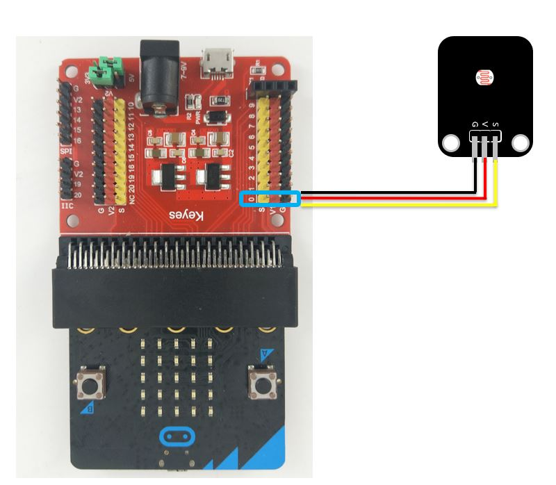

# 熱敏（溫度）模組


## LinkIt 7697 專案說明

使用「LinkIt 7697 NANO Breakout」連接「熱敏（溫度）模組」，每0.5秒讀取熱敏（溫度）模組的溫度訊號比例。

此**熱敏（溫度）模組**包含於「[**洞洞么教學材料包**](https://www.robotkingdom.com.tw/product/rk-education-kit-001/) 」內。

### LinkIt 7697 電路圖

* [LinkIt 7697](https://www.robotkingdom.com.tw/product/linkit-7697/)
* LinkIt 7697 NANO Breakout
* 熱敏（溫度）模組

**熱敏（溫度）模組**是**數位/類比訊號**輸出， 可以接「D0 ~ D13、A0~A3」的 LinkIt 7697 NANO Breakout訊號端上。 本範例連接到「**D5**」、「**A0**」。


### BlocklyDuino 積木畫布

每0.5秒鐘讀取熱敏（溫度）模組溫度的類比及數位資訊一次 。


### Arduino 程式

```c
void setup()
{

  pinMode(5, INPUT);
  Serial.begin(9600);

}


void loop()
{
  Serial.println(digitalRead(5));
  Serial.println(analogRead(14));
  delay(500);
}
```

## micro:bit 專案說明

使用「micro:bit搭配科易KEYES micro:bit 感測器擴充板 V2」連接「熱敏（溫度）模組」，讀取熱敏（溫度）模組的數值變化 。

此**熱敏（溫度）模組**包含於「[**洞洞么教學材料包**](https://www.robotkingdom.com.tw/product/rk-education-kit-001/)」內。

### micro:bit電路圖

* [BBC micro:bit 微控制板
  ](https://www.robotkingdom.com.tw/product/bbc-microbit-1/)
* [科易KEYES micro:bit 感測器擴充板 V2
  ](https://www.robotkingdom.com.tw/product/keyes-microbit-sensor-breakout-v2/)
* 熱敏（溫度）模組

**熱敏（溫度）模組**是**數位/類比訊號**輸出，可以接「3~7、9~11/0、1、2、3、4、10」的 micro:bit訊號端上，數位訊號輸出建議使用的是5跟11腳位，因為3、4、6、7、9、10腳位有使用到LED控制腳位所以當顯示LED時會不穩定。類比訊號輸出建議使用的是0、1、2腳位因為3、4、10腳位有使用到LED控制腳位所以當顯示LED時會不穩定。本範例連接到「P5、P0」。



### Microsoft MakeCode積木畫布

每1秒鐘會讀取熱敏（溫度）模組溫度的類比及數位資訊一次 ，並可透過micro:bit顯示指示燈看到熱敏（溫度）模組溫度的電位數值。


### JavaScript 程式

```javascript
basic.forever(function () {
    basic.showNumber(pins.digitalReadPin(DigitalPin.P5))
    basic.pause(1000)
    basic.showNumber(pins.analogReadPin(AnalogPin.P0))
})
```

