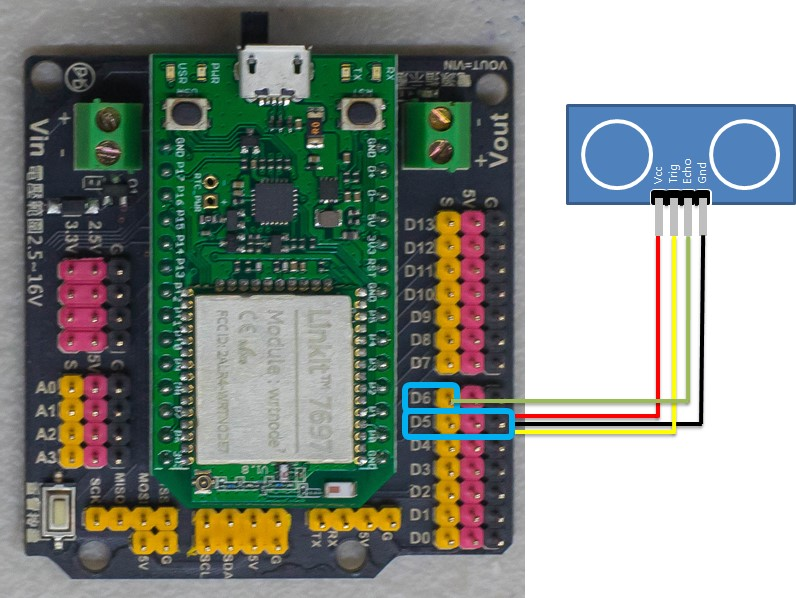
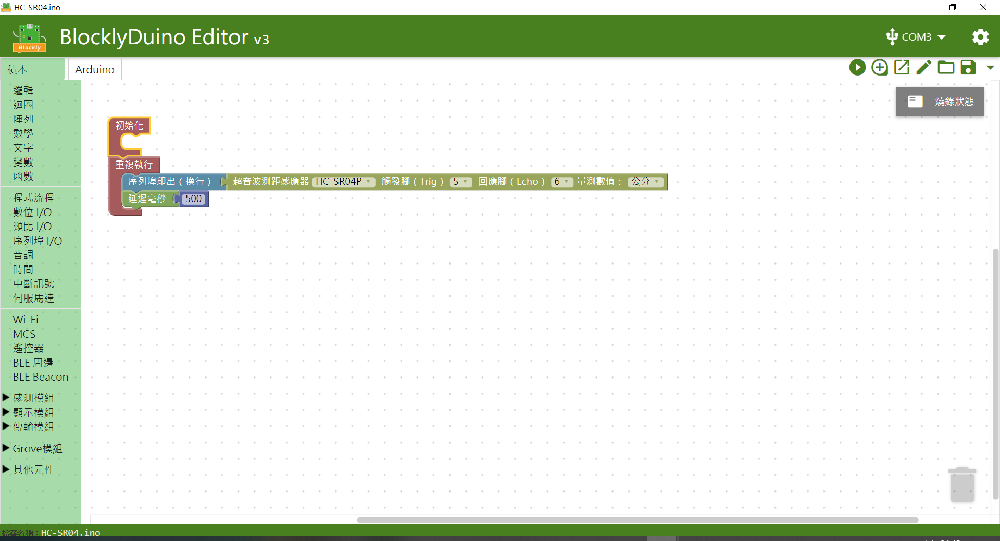
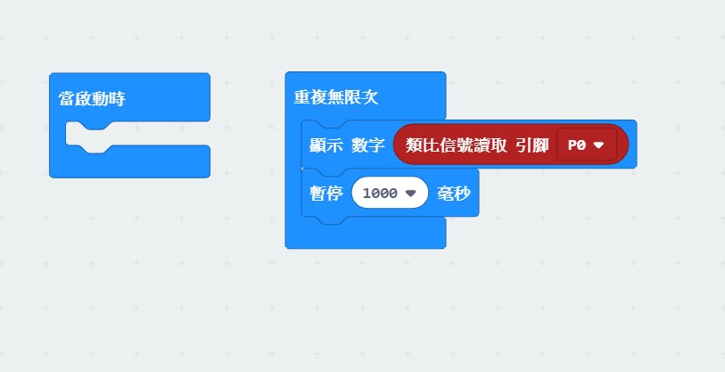

# 超音波測距感測器


## LinkIt 7697 專案說明

使用「LinkIt 7697 NANO Breakout」連接「超音波測距感測器」， 每0.5秒讀取超音波測距感測器所測到的距離。

此**超音波測距感測器**包含於「[**洞洞么教學材料包**](https://www.robotkingdom.com.tw/product/rk-education-kit-001/) 」內。

### LinkIt 7697 電路圖

* [LinkIt 7697](https://www.robotkingdom.com.tw/product/linkit-7697/)
* LinkIt 7697 NANO Breakout
* 超音波測距感測器

**超音波測距感測器**是**類比訊號**輸出， 可以接「D0 \~ D13」的 LinkIt 7697 NANO Breakout訊號端上。 本範例連接到「**D5**」、「**D6**」 。


超音波測距感測器是由發射器、接收器以及控制電路所組成，若待測物體距離太遠，或者發射器、接收器其中一個被遮蔽，皆會導致量測距離結果錯誤。

\
另外還有一點需要注意的部分，如果您用到使用I2C腳位的模組來顯示此超音波的數值，例如I2C 1602液晶顯示模組，必須避免使用D8、D9腳位來讀取超音波的數值，因為D8(I2C1\_CLK)、D9(I2C1\_DATA)就是7697的I2C腳位，同時使用會發生數值無法正常顯示在顯示模組上。




### BlocklyDuino 積木畫布

每0.5秒鐘會讀取一次超音波測距感測器所測得的距離。




### Arduino 程式

```c
#include <Ultrasonic.h>

Ultrasonic ultrasonic_5_6(5, 6);

void setup()
{

  Serial.begin(9600);

}


void loop()
{
  Serial.println(ultrasonic_5_6.convert(ultrasonic_5_6.timing(), Ultrasonic::CM));
  delay(500);
}
```

## micro:bit 專案說明

使用「micro:bit搭配科易KEYES micro:bit 感測器擴充板 V2」連接「超音波測距感應器」，每1秒讀取超音波測距感應器所測到的距離。

此**超音波測距感應器**包含於「[**洞洞么教學材料包**](https://www.robotkingdom.com.tw/product/rk-education-kit-001/)」內。

### micro:bit電路圖

* [BBC micro:bit 微控制板
  ](https://www.robotkingdom.com.tw/product/bbc-microbit-1/)
* [科易KEYES micro:bit 感測器擴充板 V2
  ](https://www.robotkingdom.com.tw/product/keyes-microbit-sensor-breakout-v2/)
* 超音波測距感應器

**超音波測距感應器**是**類比訊號**輸入，可以接「0、1、2、3、4、10」的 micro:bit訊號端上，建議使用的是0、1、2腳位因為3、4、10腳位有使用到LED控制腳位所以當顯示LED時會不穩定。本範例連接到「P0、P1」。


超音波測距感測器是由發射器、接收器以及控制電路所組成，若待測物體距離太遠，或者發射器、接收器其中一個被遮蔽，皆會導致量測距離結果錯誤。


.JPG>)

### Microsoft MakeCode積木畫布

在使用超音波測距感應器之前，需要擴展超音波測距感應器的指令庫。打開makecode程式設計平臺，滾動至指令區最底部，依次點擊進階----擴展，並使用以下網址安裝套件。

超音波測距感應器套件安裝網址：[https://github.com/lioujj/pxt-sensors
](https://github.com/lioujj/pxt-sensors)



 (2).JPG>)

.jpg>)

每1秒鐘會讀取一次超音波測距感測器所測得的距離，並可透過micro:bit顯示指示燈看到超音波測距感測器所測得的距離（小數點四捨五入後顯示）。

.JPG>)

### JavaScript 程式

```javascript
basic.forever(function () {
    basic.showNumber(Math.round(sensors.sensor_ping(
    DigitalPin.P1,
    DigitalPin.P0,
    sensors.PingUnit.Centimeters
    )))
    basic.pause(1000)
})
```


## Raspberry Pi Pico 專案說明

使用「Raspberry Pi Pico」連接「超音波測距感測器模組」, 每0.5秒讀取超音波測距感測器所測到的距離。此**超音波測距感測器模組**包含於「[洞洞么教學材料包](https://robotkingdom.com.tw/product/rk-education-kit-001/)」內。


### 超音波測距感測器模組電路圖

* [Raspberry Pi Pico](https://robotkingdom.com.tw/product/raspberry-pi-pico/)[
  ](https://www.robotkingdom.com.tw/product/bbc-microbit-1/)
* [Raspberry Pi Pico擴充板](https://robotkingdom.com.tw/product/pipico-education-kit-001/)[
  ](https://www.robotkingdom.com.tw/product/keyes-microbit-sensor-breakout-v2/)
* 超音波測距感測器模組

> **超音波測距感測器模組**是**類比訊號輸出**， 可以接「D0 \~ D28」的Raspberry Pi Pico擴充板訊號端上。 本範例連接到「D8」、「D9」。


超音波測距感測器是由發射器、接收器以及控制電路所組成，若待測物體距離太遠，或者發射器、接收器其中一個被遮蔽，皆會導致量測距離結果錯誤。



<figure><figcaption></figcaption></figure>


### Arduino IDE程式

> 每0.5秒鐘會讀取一次超音波測距感測器所測得的距離。


Arduino程式(Ultrasonic.ino)如下:

```arduino
#include <Ultrasonic.h>

Ultrasonic ultrasonic_9_10(9, 10);

void setup()
{
  Serial.begin(9600);
}

void loop()
{
  Serial.println(ultrasonic_9_10.convert(ultrasonic_9_10.timing(), Ultrasonic::CM));
  delay(500);
}
```


### 程式執行結果

<figure><figcaption></figcaption></figure>
