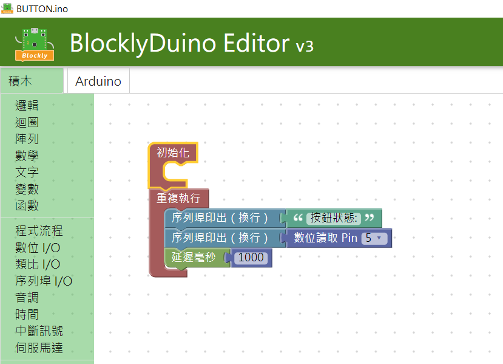
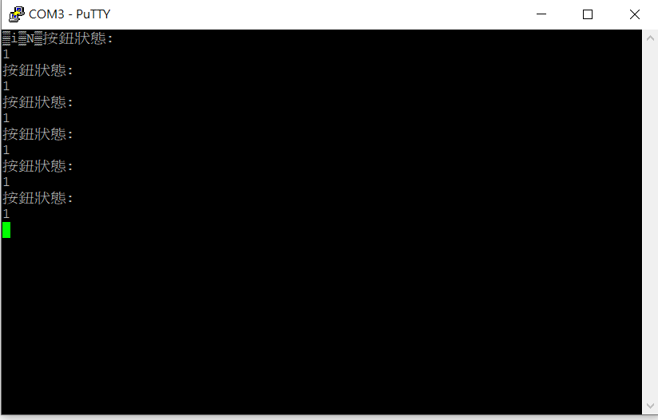
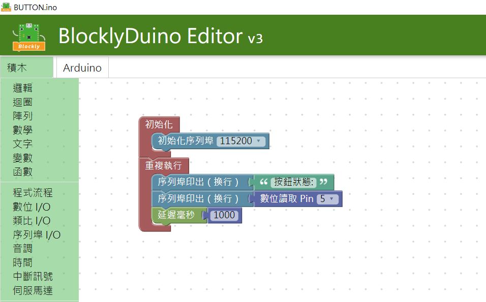
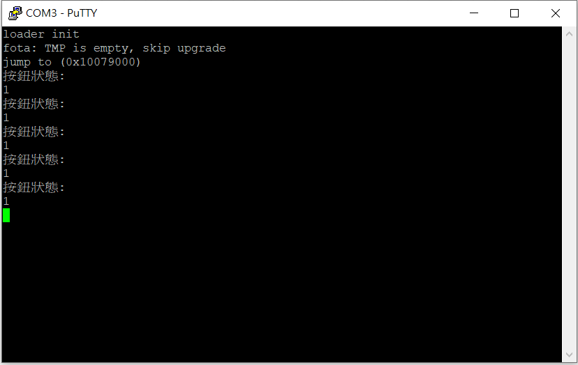

# 新版LinkIt 7697開發板 V1.1版使用序列埠印出指令亂碼問題

**新版LinkIt 7697開發板 V1.1版使用序列埠印出的指令，燒錄程式後開啟序列埠一開始會有印出亂碼的現象。**

**我們跟製造商已聯絡晶片廠商處理此訊息問題。  
  
檢測結果發現此亂碼為LinkIt 7697初始化訊息，因新版LinkIt 7697初始化訊息預設鮑率為115200所以當使用BlocklyDuino3或arduino預設鮑率為9600時皆會出現亂碼，把預設鮑率改為115200初次開啟序列埠或按RST 按鈕就會正常顯示以下初始化訊息。**

**loader init**

**fota: TMP is empty, skip upgrade**

**jump to \(0x10079000\)**

**此訊息為加載程序初始化並且跳過升級的正常訊息。**  

**loader init**

**fota: TMP is empty, skip upgrade**

**jump to \(0x10079000\)**

**此訊息為加載程序初始化並且跳過升級的正常訊息。**  

**預設預設鮑率為9600時會出現亂碼**

**把鮑率改為115200**

**參考資料:**

[**https://docs.labs.mediatek.com/resource/mt7687-mt7697/en/get-started-linkit-7697-hdk/gcc-arm-embedded-linkit-7697/connect-to-the-serial-port-linkit-7697**](https://docs.labs.mediatek.com/resource/mt7687-mt7697/en/get-started-linkit-7697-hdk/gcc-arm-embedded-linkit-7697/connect-to-the-serial-port-linkit-7697)  

