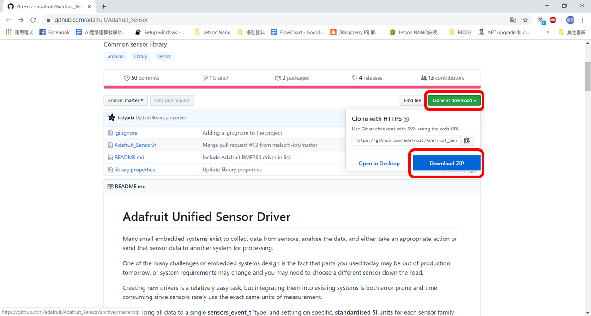
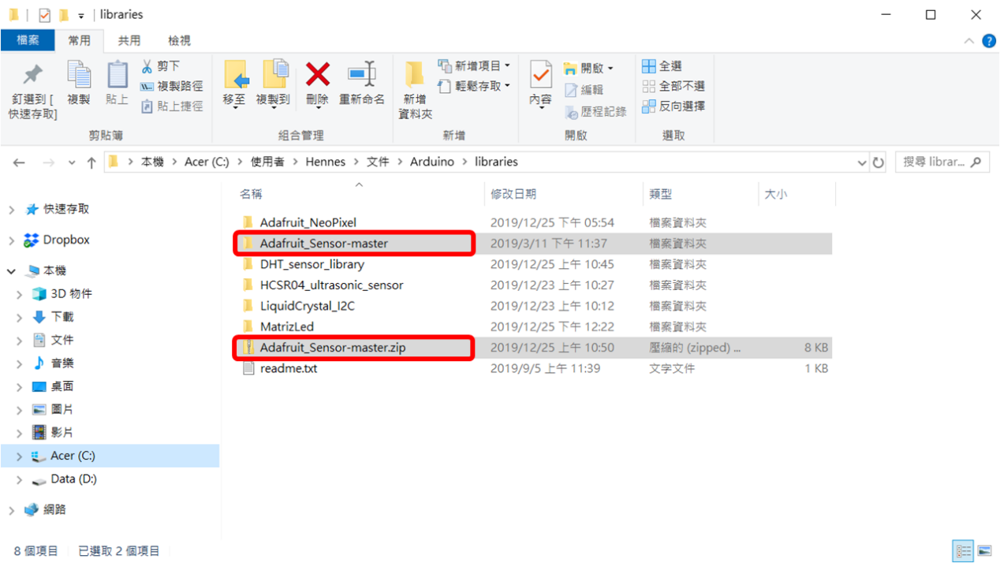
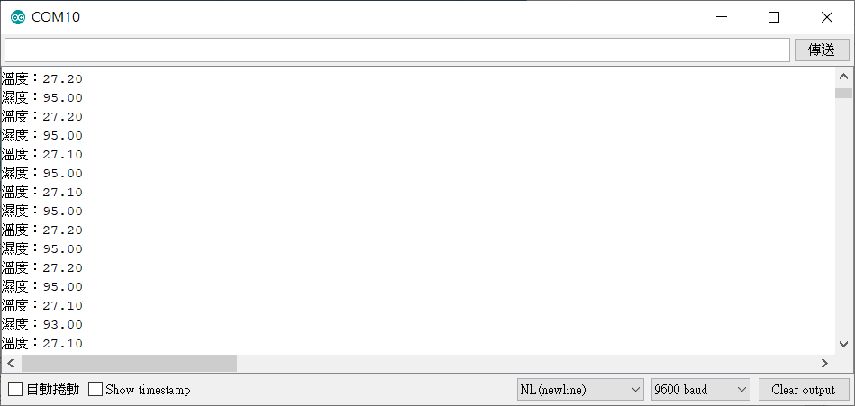

# DHT11溫溼度模組


## 專案說明

使用「科易KEYES Arduino UNO R3 開發板」連接「DHT11溫溼度模組」,讀取DHT11溫溼度模組所測到的溫度、溼度。

此**DHT11溫溼度模組**包含於「[洞洞兩教學材料包 Education Kit 002](https://www.robotkingdom.com.tw/product/rk-education-kit-002/)」內。

## KEYES Arduino UNO R3電路圖

* [KEYES Arduino UNO R3 
  ](https://www.robotkingdom.com.tw/product/keyes-uno-r3/)
* 通用型彩色Sensor shield v5.0感測器擴充板
* DHT11溫溼度模組

**DHT11溫溼度模組**是**數位訊號**輸出， 可以接「D0 ~ D13」的KEYES Arduino UNO R3訊號端上。 本範例連接到「**D3**」


## Arduino 程式

由於DHT11溫溼度模組是函式庫型模組，所以需要先在Arduino上下載函式庫，下載方法如下。

在Arduino上選擇工具，選擇管理程式庫，在管理程式庫搜尋DHT sensor選擇DHT sensor library by adafruit版本1.3.6並安裝。


注意：只下載此函式庫的話，編譯範例程式會出現錯誤，

需下載以下函式庫並放入Arduino函式庫中\(Arduino資料夾中libraries資料夾裡面\)


[https://github.com/adafruit/Adafruit\_Sensor
](https://github.com/adafruit/Adafruit_Sensor)

函式庫名稱為 Adafruit\_Sensor-master

以上函式庫也是官方版1.3.0以上函式庫所額外需要的函式庫，下載之後放到Arduino函式庫目錄中，就能解決1.3.0版以上編譯錯誤的問題。




按右上角Clone or download選擇Download ZIP



接著把下載好的ZIP檔解壓縮到Arduino資料夾中libraries資料夾

每1秒鐘會讀取一次DHT11溫溼度模組所測得的溫度、溼度 。



產生出的 Arduino 程式如下

```c
#include <DHT.h>

DHT dht11_p3(3, DHT11);

void setup()
{

  Serial.begin(9600);

  dht11_p3.begin();
}


void loop()
{
  Serial.print("溫度：");
  Serial.println(dht11_p3.readTemperature());
  Serial.print("濕度：");
  Serial.println(dht11_p3.readHumidity());
  delay(1000);
}

```


