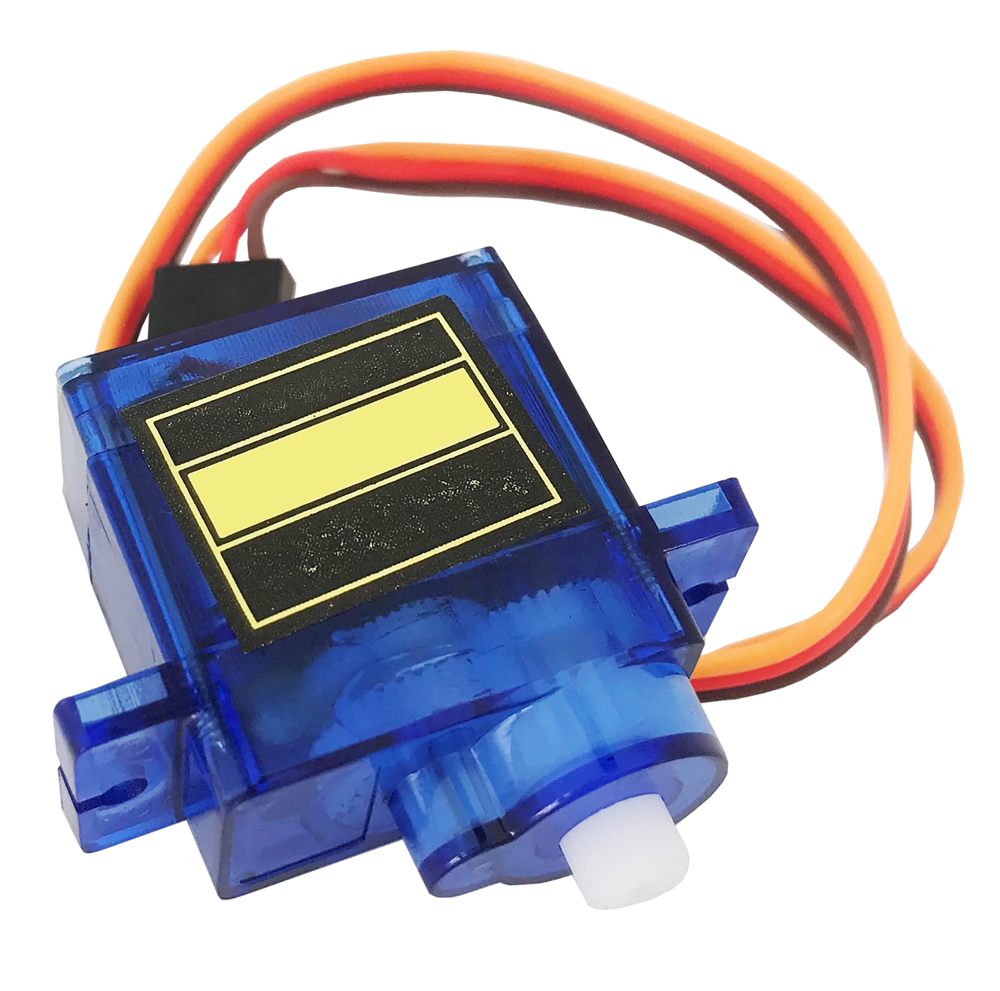

# 舵機



## 專案說明

使用「科易KEYES Arduino UNO R3 開發板」連接「舵機」, 控制舵機順時針轉和逆時針轉。

此**舵機**包含於「[洞洞兩教學材料包 Education Kit 002](https://www.robotkingdom.com.tw/product/rk-education-kit-002/)」內。

## KEYES Arduino UNO R3電路圖

* [KEYES Arduino UNO R3](https://www.robotkingdom.com.tw/product/keyes-uno-r3/) 
* 通用型彩色Sensor shield v5.0感測器擴充板
* 舵機

**舵機**是**數位訊號**輸出，脈衝寬度調變\(Pulse Width Modulation\)訊號輸出， 可以接「D0 ~ D13」的KEYES Arduino UNO R3訊號端上。 本範例連接到「**D3**」


## Arduino 程式

由於舵機是函式庫型模組，所以需要先在Arduino上下載函式庫，下載方法如下。

在Arduino上選擇工具，選擇管理程式庫，在管理程式庫搜尋Servo選擇Servo Built-In by Michael Margolis, Arduino版本1.1.3並安裝。


控制舵機順時針轉和逆時針轉。

產生出的 Arduino 程式如下

```c
#include <Servo.h>

Servo myservo;  

int pos = 0;    

void setup() {
  myservo.attach(3); 
}

void loop() {
  for (pos = 0; pos <= 180; pos += 1) { 
    myservo.write(pos);             
    delay(15);                       
  }
  for (pos = 180; pos >= 0; pos -= 1) { 
    myservo.write(pos);              
    delay(15);                      
  }
}

```

