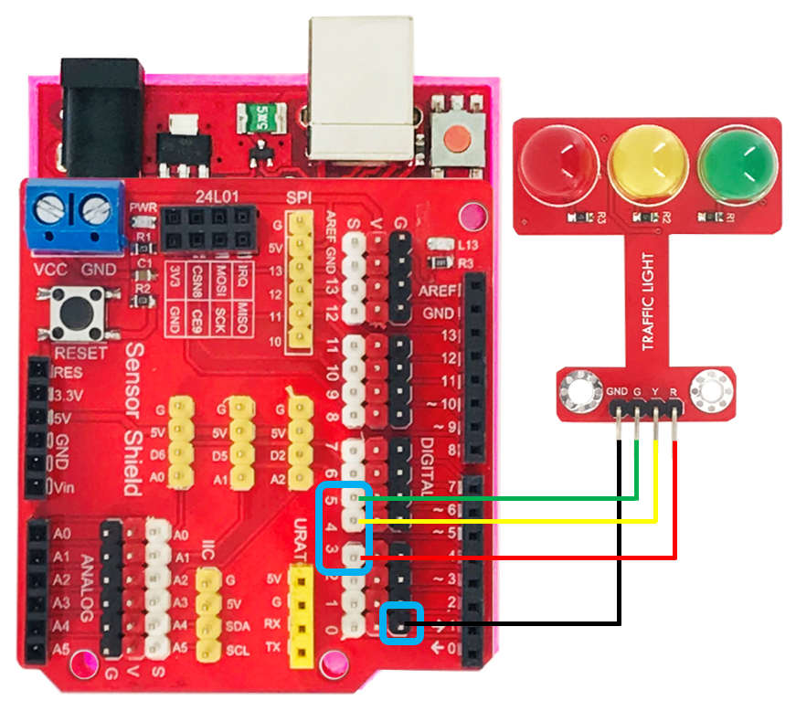
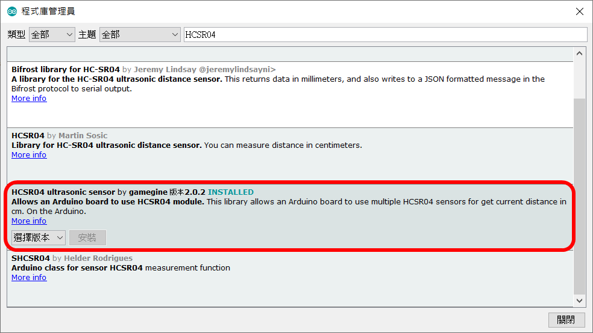
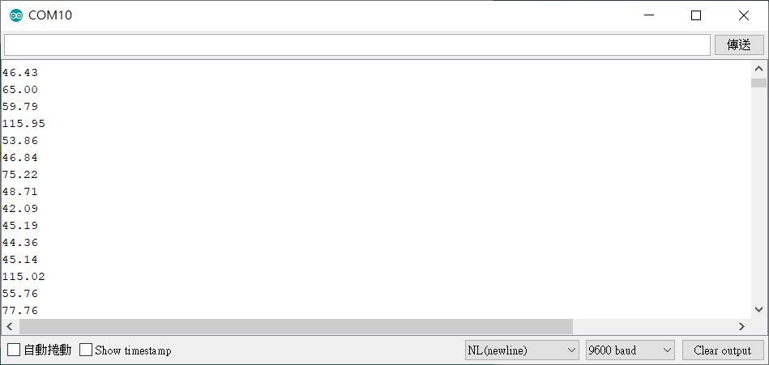

# SR-04P超音波


## 專案說明

使用「科易KEYES Arduino UNO R3 開發板」連接「SR-04P超音波」,讀取SR-04P超音波感測器所測到的距離。

此**SR-04P超音波**包含於「[洞洞兩教學材料包 Education Kit 002](https://www.robotkingdom.com.tw/product/rk-education-kit-002/)」內。

## KEYES Arduino UNO R3電路圖

* [KEYES Arduino UNO R3 
  ](https://www.robotkingdom.com.tw/product/keyes-uno-r3/)
* 通用型彩色Sensor shield v5.0感測器擴充板
* SR-04P超音波

**SR-04P超音波**是**數位訊號**輸出， 可以接「D0 ~ D13」的KEYES Arduino UNO R3訊號端上。 本範例連接到「**D3**」「**D4**」


超音波測距感測器是由發射器、接收器以及控制電路所組成，若待測物體距離太遠，或者發射器、接收器其中一個被遮蔽，皆會導致量測距離結果錯誤 。




## Arduino 程式

由於超音波測距感測器是函式庫型模組，所以需要先在Arduino上下載函式庫，下載方法如下。

在Arduino上選擇工具，選擇管理程式庫，在管理程式庫搜尋HCSR04選擇HCSR04 ultrasonic sensor by gamegine版本2.02並安裝。




每0.5秒鐘會讀取一次超音波測距感測器所測得的距離 。



產生出的 Arduino 程式如下

```c
#include <HCSR04.h>

HCSR04 hc(3,4);//initialisation class HCSR04 (trig pin , echo pin)

void setup()
{ Serial.begin(9600); }

void loop()
{ Serial.println( hc.dist() ); 
  delay(500);
}//return curent distance in serial

```


