# 程式撰寫軟體下載

### 程式撰寫軟體下載 

洞洞五模組之程式撰寫介面，請下載Raspberry Pi Pico W專屬程式撰寫軟體，連結:

[https://reurl.cc/oZGK63](https://reurl.cc/oZGK63)

.png>)

下載至電腦後，請解壓縮程式。

### 透過Arduino IDE找COM Port (序列埠)編號

* 開啟 Arduino IDE

執行 arduino.exe ，檔案在BlocklyduinoF2>arduino-1.8.19裡

.png>)

* 按下允許存取，即可開啟Arduino IDE。

.png>)

* 開啟Arduino IDE

.png>)

* 選擇燒錄程式

Raspberry Pi Pico W 在第一次燒錄時，裝置管理員並沒有顯示COM Port 編號，所以先用最簡單的 Blink 程式找出 COM Port。程式路徑:**檔案->範例->01.Basis->Blink**

.png>)

* 燒錄程式

在上傳程式前，先按住Raspberry Pi Pico W 的 BOOTSET 按鈕，再，插上USB 傳輸線連接到電腦。

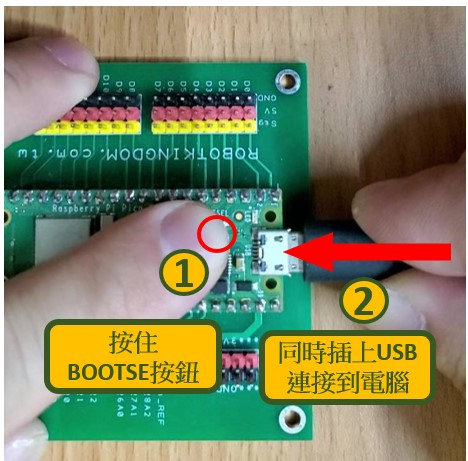

* 選擇UF2 Board

由上述步驟操作時，請選擇 UF2 Board ，

路徑:**工具 > 序列埠 > UF2 Board**

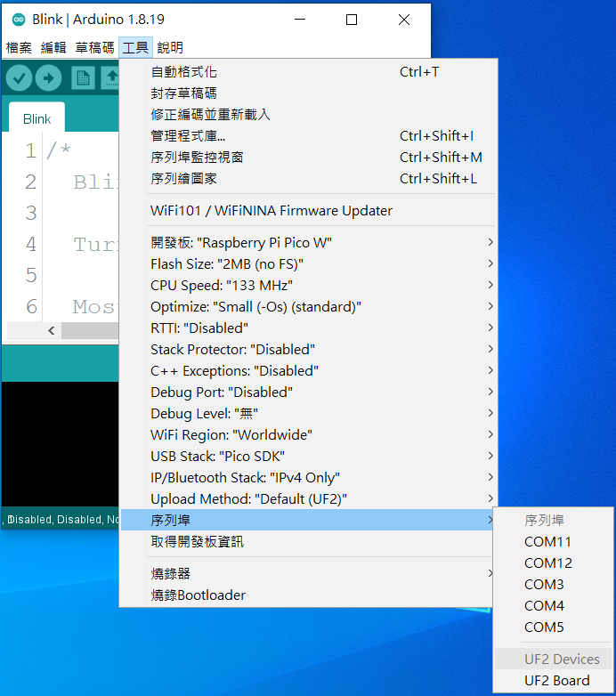

按下**上傳**鍵。

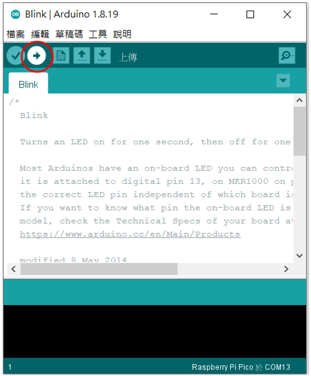

* 上傳成功

上傳成功，會出現**上傳完畢**

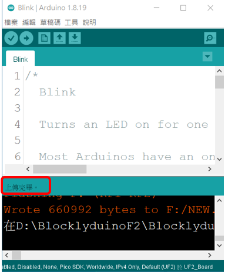

燒錄成功，會看到板載 LED 燈開始閃爍。

* 找到燒綠程式的 COM Port 編號

選擇 Com port 編號，路徑為:

**工具->序列埠->COM XX(Raspberry Pi Pico W)**

至此，Raspberry Pi Pico W 的 COM Port 已設定完成，之後就可使用 Blocklyduino 積木介面來撰寫程式。

### 使用 BlocklyDuino 燒錄程式前設定 

本開發包的模組均可以使用 BlocklyDuino 積木程式來撰寫，但也是要設定燒錄的開發板，和開發板腳位。

軟體載點連結(BlocklyDuino F2):

[https://reurl.cc/oZGK63](https://reurl.cc/oZGK63)

* 開啟 BlocklyDuino

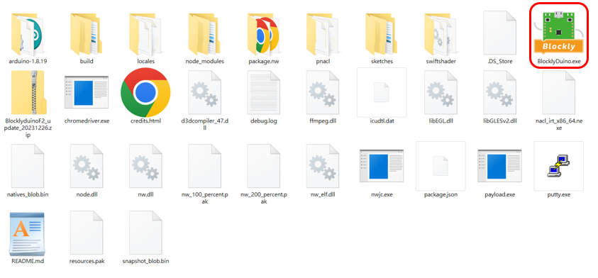

* 選取開發板為 Raspberry Pi Pico W

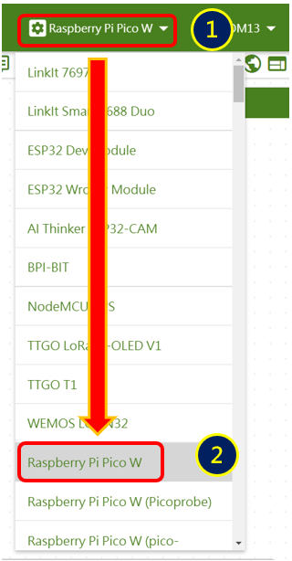

* 選擇序列埠腳位(需和 Arduino IDE 一致)

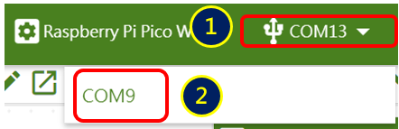

* 積木的開發板要選 Pico
* 

至此 Raspberry Pi Pico W 的燒錄腳位皆已設定完成，下一個步驟就是如何透過BlocklyDuino 撰寫及燒錄程式。

### BlocklyDuino 燒錄程式 

如何透過 BlocklyDuino 燒錄程式，首先先寫出 Blink 程式，即 Raspberry Pi Pico W 的板載 LED 燈閃爍一秒。

* 撰寫程式，以下是 BlocklyDuino 程式。

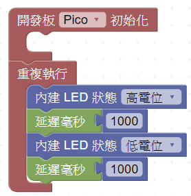

* 上傳程式

按下**三角形**燒錄鍵

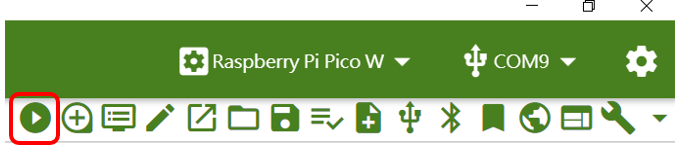

* 下載韌體

按下**下載**鍵

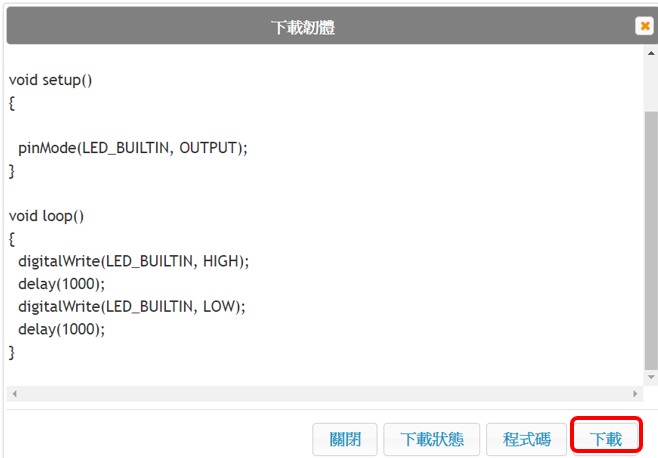

* 燒錄成功

燒錄過程中沒有出現 **error** ，而最後會出現 Finish 的字 ，表示燒錄成功， 以下圖所示。

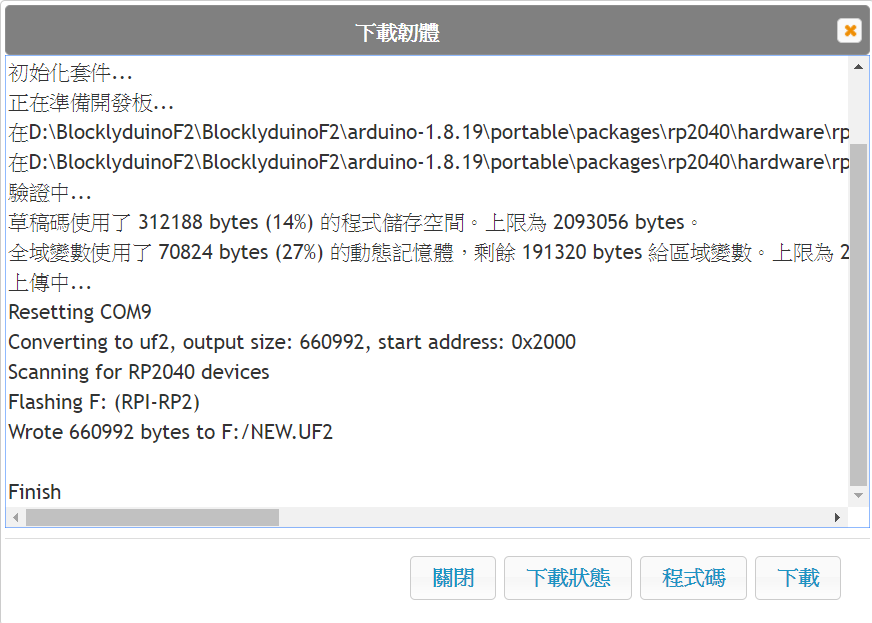

**材料包程式下載**

**材料包所有程式下載連結:**

[https://reurl.cc/bVg5ar](https://reurl.cc/bVg5ar)
