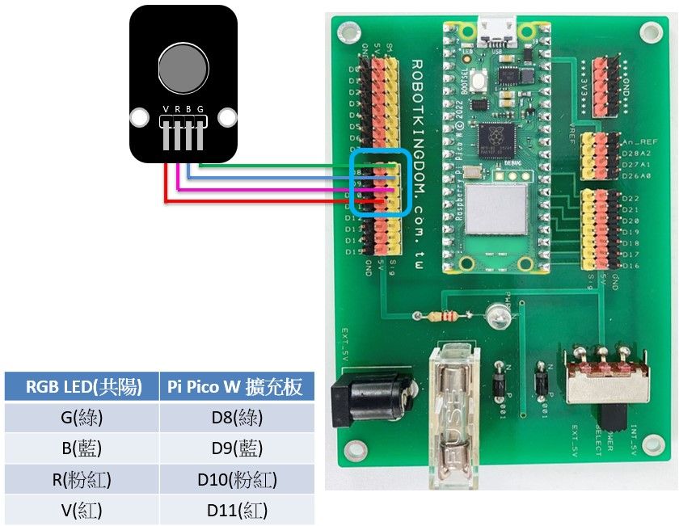

# RGB全彩LED模組(共陽極)

## RGB全彩LED模組(共陽極) <a href="#toc124882502" id="toc124882502"></a>

專案說明

使用「Raspberry Pi Pico W」連接「旋轉電位計模組」, 控制RGB全彩LED模組的顏色變化。此 RGB全彩LED模組包含於「洞洞五教學材料包」內。

### RGB全彩LED模組電路圖

·        Raspberry Pi Pico W

·        Raspberry Pi Pico W擴充板

·        RGB全彩LED模組&#x20;

| RGB全彩LED模組是數位訊號輸入，  可以接「D0\~ D28」的Raspberry Pi Pico W擴充板訊號端上。  本範例連接到「D8」、「D9」、「D10」上。 |
| -------------------------------------------------------------------------------------- |

<figure><figcaption></figcaption></figure>

### BlocklyDuino 程式 (RGB\_Blink)

共陽極的LED模組，腳位需為低電位才會亮燈；高電位才會關燈。而本專案使用「函式」的模組，來定義亮紅燈、藍燈、綠燈和關燈。

程式在初始化時是全部關燈，在重複執行時亮起紅燈、藍燈、綠燈和關燈，並都是間隔一秒。&#x20;

<figure><figcaption></figcaption></figure>

### &#x20;Arduino 程式(RGB\_Blink.ino)如下

```arduino
void Green() {
  digitalWrite(8, LOW);
  digitalWrite(9, HIGH);
  digitalWrite(10, HIGH);
}
 
void Red() {
  digitalWrite(8, HIGH);
  digitalWrite(9, HIGH);
  digitalWrite(10, LOW);
}
 
void Blue() {
  digitalWrite(8, HIGH);
  digitalWrite(9, LOW);
  digitalWrite(10, HIGH);
}
 
void Closed() {
  digitalWrite(8, HIGH);
  digitalWrite(9, HIGH);
  digitalWrite(10, HIGH);
}
 
void setup()
{
  Closed();
  pinMode(8, OUTPUT);
  pinMode(9, OUTPUT);
  pinMode(10, OUTPUT);
}
 
void loop()
{
  Red();
  delay(1000);
  Blue();
  delay(1000);
  Green();
  delay(1000);
  Closed();
  delay(1000);
}
```

### 程式執行結果:

亮起紅燈、藍燈、綠燈和關燈，並都間隔一秒。

&#x20;.png>).png>).png>).png>)

&#x20;
